# 0.0.0 Overview {.divider}

```{=html}
<div class="left-panel">
  <div class="number">0</div>
  <div class="label">OVERVIEW</div>
</div>
<div class="right-panel">
  
</div>
```

## 0.1 MAIN CONCEPTS {.content}

```{=html}
<div class="top-bar">0. OVERVIEW</div>
<div class="screenshot-row" style="
    --highlight-x:57.0%;
    --highlight-y:88.5%;
    --highlight-w:6.1%;
    --highlight-h:8.9%;">
  <div class="callout-box">
    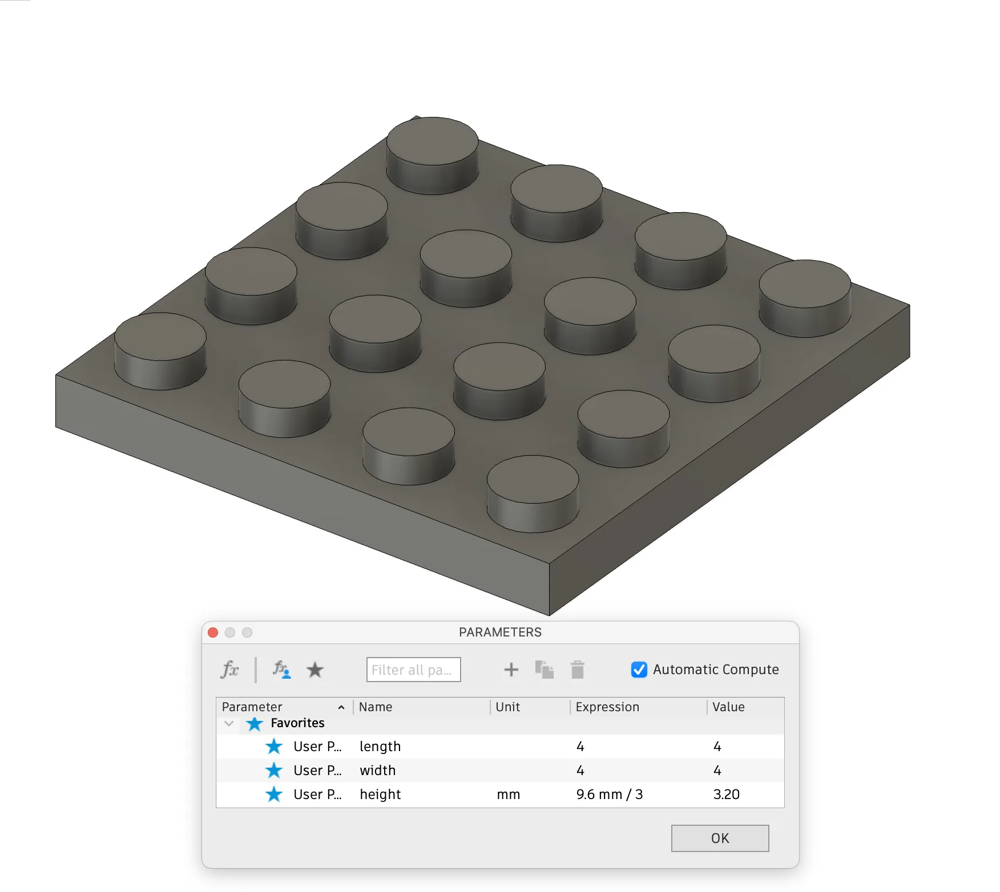
    <div class="callout-label">
      0.1.1: Sketch -> Dimension -> Extrude Fit Tolerances Parametric Design 0.1 mm gap 0.2 mm gap 0.3 mm gap 0.4 mm gap
    </div>
    <p class="concept-insight"><strong>*</strong> Keep dimensions parametric where possible.</p>
  </div>
  <div class="main-panel">
    <div class="main-shot-wrap">
      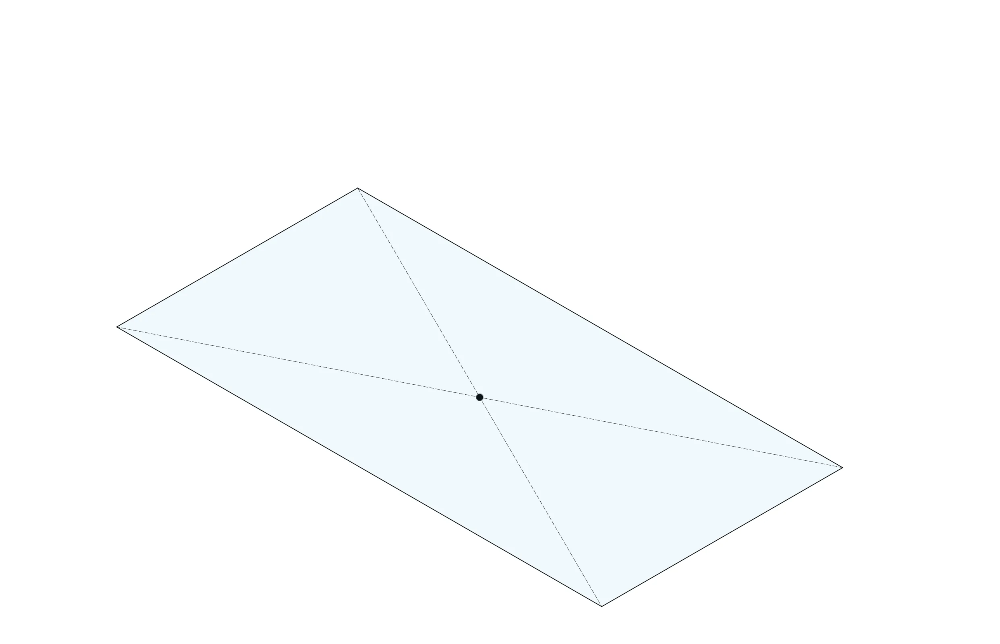
      <div class="click-highlight" aria-hidden="true"></div>
    </div>
  </div>
</div>
```

## 0.2 SKETCH -> DIMENSION -> EXTRUDE {.content}

```{=html}
<div class="top-bar">0. OVERVIEW</div>
<div class="screenshot-row" style="
    --highlight-x:26.6%;
    --highlight-y:40.2%;
    --highlight-w:55.8%;
    --highlight-h:58.4%;">
  <div class="callout-box">
    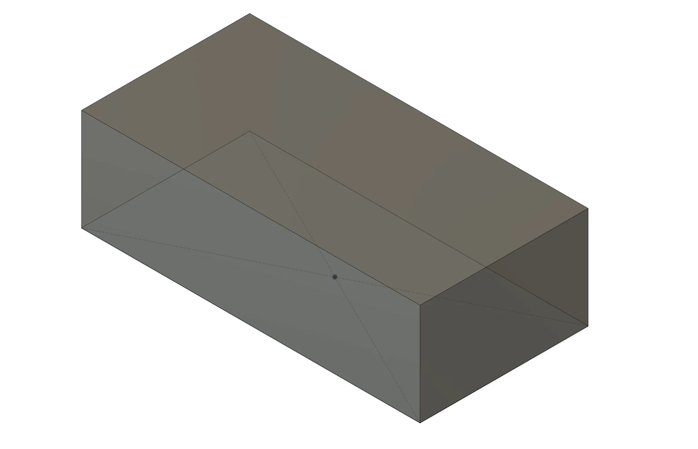
    <div class="callout-label">
      0.2.1: ensures accurate measurements and proportions, sketching creates the initial 2D shapes, and extruding transforms these sketches into 3D objects. This straightforward yet powerful process forms the backbone of creating detailed and precise 3D models for various applications Most 3D modeling involves three fundamental steps: sketching, dimensioning ,and extruding. S ketching creates the initial 2D shapes, Dimensioning ensures accurate measurements and proportions,  and extruding transforms these sketches into 3D objects. This straightforward yet powerful process forms the backbone of creating detailed and precise 3D models
    </div>
    <p class="concept-insight"><strong>*</strong> Keep dimensions parametric where possible.</p>
  </div>
  <div class="main-panel">
    <div class="main-shot-wrap">
      
      <div class="click-highlight" aria-hidden="true"></div>
    </div>
  </div>
</div>
```

## 0.3 PARAMETRIC DESIGN {.content}

```{=html}
<div class="top-bar">0. OVERVIEW</div>
<div class="screenshot-row" style="
    --highlight-x:20.5%;
    --highlight-y:33.2%;
    --highlight-w:55.7%;
    --highlight-h:57.4%;">
  <div class="callout-box">
    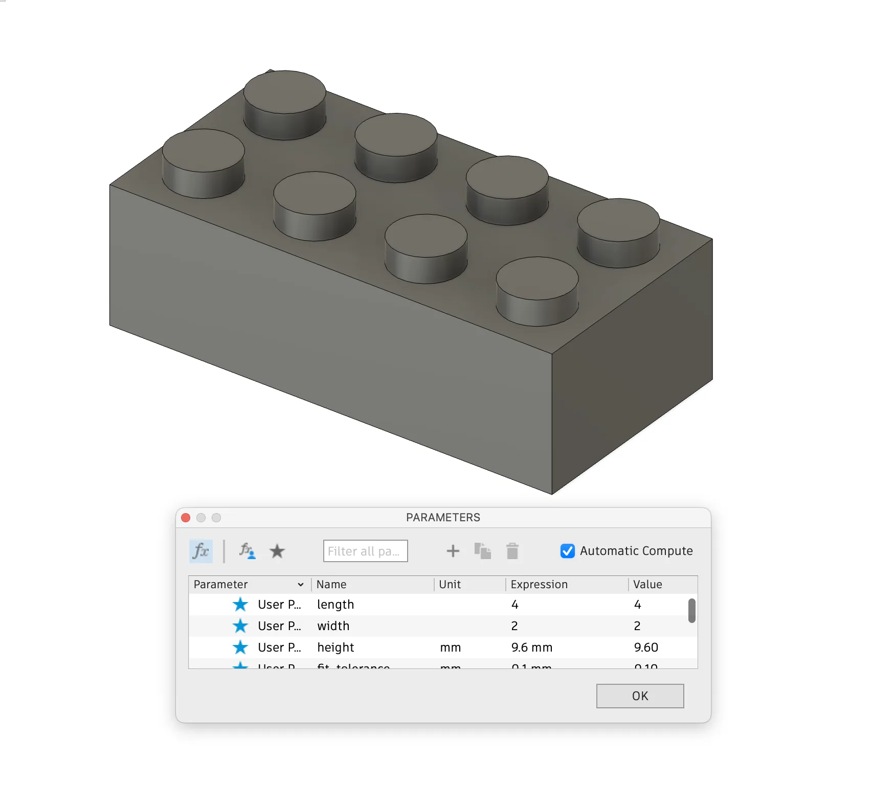
    <div class="callout-label">
      0.3.1: Parametric design is a process that uses algorithms and parameters to define and manipulate the design elements of a project. By adjusting these parameters, designers can quickly explore variations and optimize their designs.
    </div>
    <p class="concept-insight"><strong>*</strong> Keep dimensions parametric where possible.</p>
  </div>
  <div class="main-panel">
    <div class="main-shot-wrap">
      
      <div class="click-highlight" aria-hidden="true"></div>
    </div>
  </div>
</div>
```

## 0.4 FIT TOLERANCES {.content}

```{=html}
<div class="top-bar">0. OVERVIEW</div>
<div class="screenshot-row" style="
    --highlight-x:37.4%;
    --highlight-y:21.8%;
    --highlight-w:53.6%;
    --highlight-h:56.1%;">
  <div class="callout-box">
    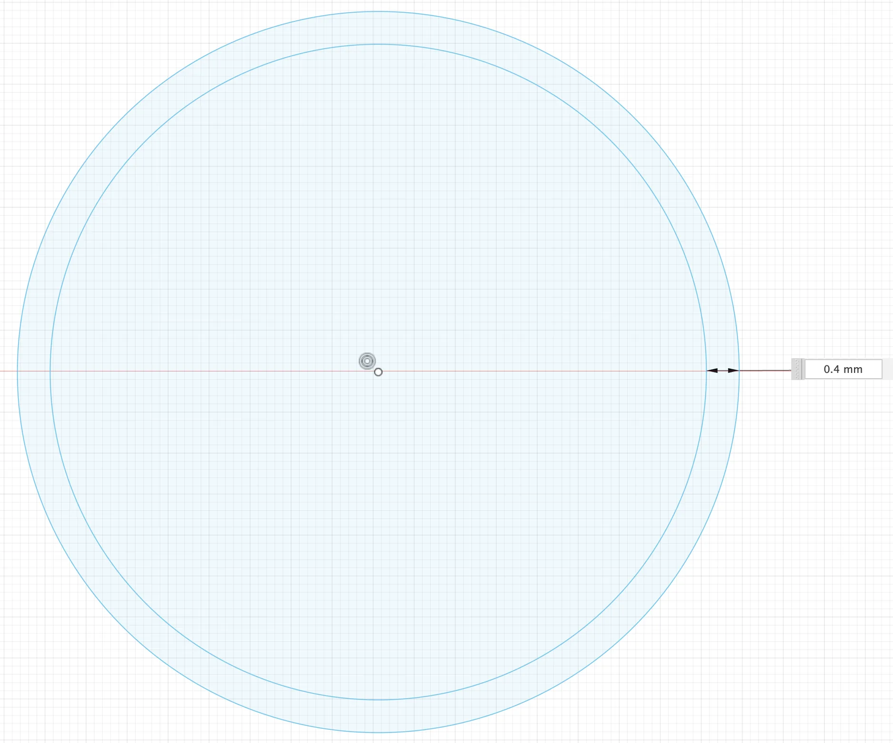
    <div class="callout-label">
      0.4.1: Interference Fit : When printing a shaft and a hole that need to be assembled with some force to ensure they stay together without additional fasteners, you might use a 0.1 mm to 0.2 mm smaller diameter on the shaft compared to the hole. Clearance Fit : For parts that need to move freely or be easily assembled and disassembled, you might design the shaft to be 0.3 mm to 0.4 mm smaller in diameter than the hole. When fitting one part into another, a gap is necessary to ensure they don’t collide. In 3D printing, these gaps typically range from 0.1 mm to 0.4 mm, providing different levels of snugness. Proper tolerance ensures smooth assembly and reliable performance 0.1 mm gap 0.2 mm gap 0.3 mm gap 0.4 mm gap
    </div>
    <p class="concept-insight"><strong>*</strong> Keep dimensions parametric where possible.</p>
  </div>
  <div class="main-panel">
    <div class="main-shot-wrap">
      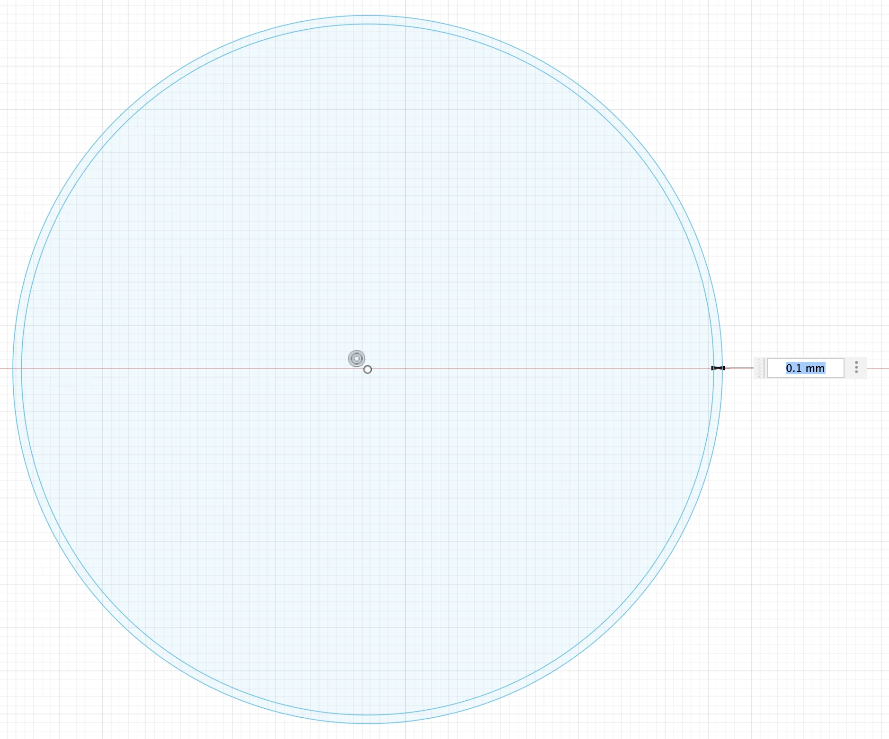
      <div class="click-highlight" aria-hidden="true"></div>
    </div>
  </div>
</div>
```

## 0.5 STEPS {.content}

```{=html}
<div class="top-bar">0. OVERVIEW</div>
<div class="screenshot-row" style="
    --highlight-x:93.2%;
    --highlight-y:81.9%;
    --highlight-w:6.2%;
    --highlight-h:3.3%;">
  <div class="callout-box">
    
    <div class="callout-label">
      0.5.1: 1. Setup 2. Enter Parameters 3. Make the Brick 4. Make the Top Stud 5. Make the Bottom Stud 6. Make the Stud Pattern
    </div>
    <p class="concept-insight"><strong>*</strong> Keep dimensions parametric where possible.</p>
  </div>
  <div class="main-panel">
    <div class="main-shot-wrap">
      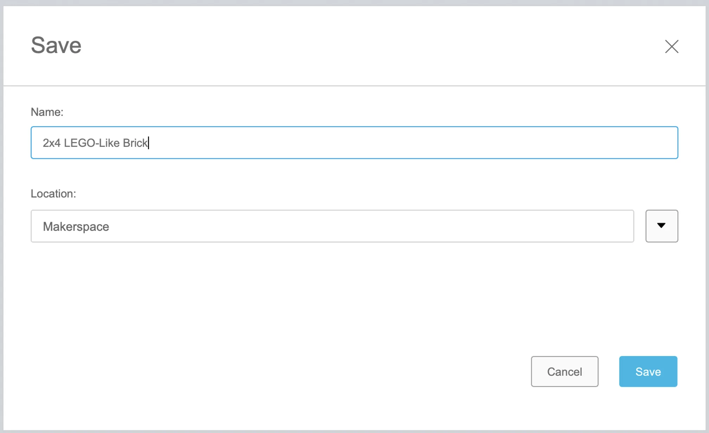
      <div class="click-highlight" aria-hidden="true"></div>
    </div>
  </div>
</div>
```

## 0.6 TOOLS USED {.content}

```{=html}
<div class="top-bar">0. OVERVIEW</div>
<div class="screenshot-row" style="
    --highlight-x:84.6%;
    --highlight-y:45.2%;
    --highlight-w:10.2%;
    --highlight-h:8.7%;">
  <div class="callout-box">
    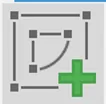
    <div class="callout-label">
      0.6.1: CHEATSHEET Create Sketch Extrude Offset Pattern Project Rectangle Circle Dimension
    </div>
    <p class="concept-insight"><strong>*</strong> Keep dimensions parametric where possible.</p>
  </div>
  <div class="main-panel">
    <div class="main-shot-wrap">
      
      <div class="click-highlight" aria-hidden="true"></div>
    </div>
  </div>
</div>
```

# 1.0.0 Setup {.divider}

```{=html}
<div class="left-panel">
  <div class="number">1</div>
  <div class="label">SETUP</div>
</div>
<div class="right-panel">
  
</div>
```

## 1.1 Create New Design {.content}

```{=html}
<div class="top-bar">1. SETUP</div>
<div class="screenshot-row" style="
  --highlight-x:2.0%;
  --highlight-y:4.2%;
  --highlight-w:12.0%;
  --highlight-h:6.0%;">
  <div class="callout-box">
    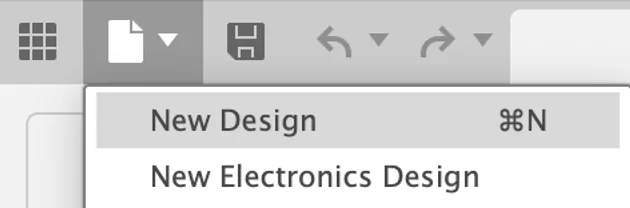
    <div class="callout-label">
      1.1.1: 1. SETUP
    </div>
    <p class="concept-insight"><strong>*</strong> Keep dimensions parametric where possible.</p>
  </div>
  <div class="main-panel">
    <div class="main-shot-wrap">
      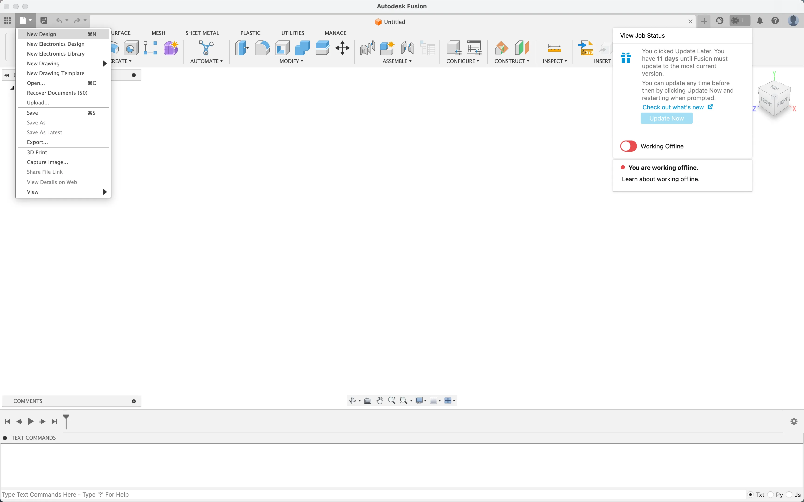
      <div class="click-highlight" aria-hidden="true"></div>
    </div>
  </div>
</div>
```

## 1.2 Change Units {.content}

```{=html}
<div class="top-bar">1. SETUP</div>
<div class="screenshot-row" style="
  --highlight-x:5.8%;
  --highlight-y:23.0%;
  --highlight-w:6.2%;
  --highlight-h:6.0%;">
  <div class="callout-box">
    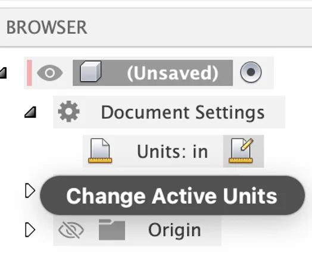
    <div class="callout-label">
      1.2.1: 1. SETUP
    </div>
    <p class="concept-insight"><strong>*</strong> Keep dimensions parametric where possible.</p>
  </div>
  <div class="main-panel">
    <div class="main-shot-wrap">
      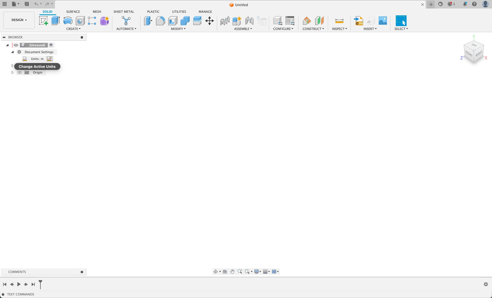
      <div class="click-highlight" aria-hidden="true"></div>
    </div>
  </div>
</div>
```

## 1.3 Set Units to mm {.content}

```{=html}
<div class="top-bar">1. SETUP</div>
<div class="screenshot-row" style="
  --highlight-x:82.4%;
  --highlight-y:18.8%;
  --highlight-w:16.0%;
  --highlight-h:33.0%;">
  <div class="callout-box">
    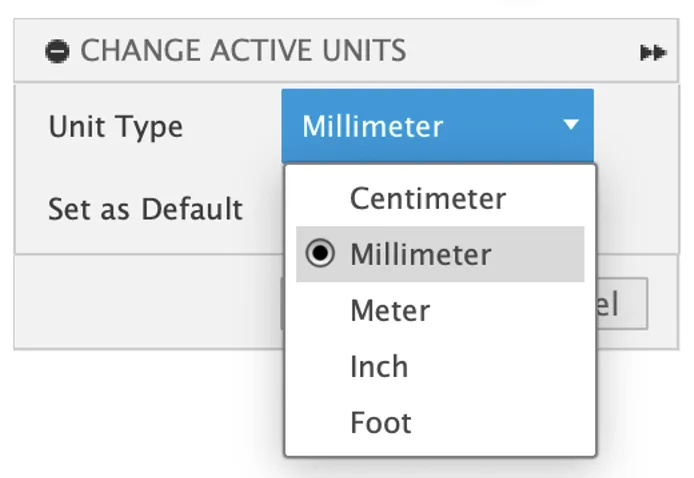
    <div class="callout-label">
      1.3.1: 1. SETUP
    </div>
    <p class="concept-insight"><strong>*</strong> Keep dimensions parametric where possible.</p>
  </div>
  <div class="main-panel">
    <div class="main-shot-wrap">
      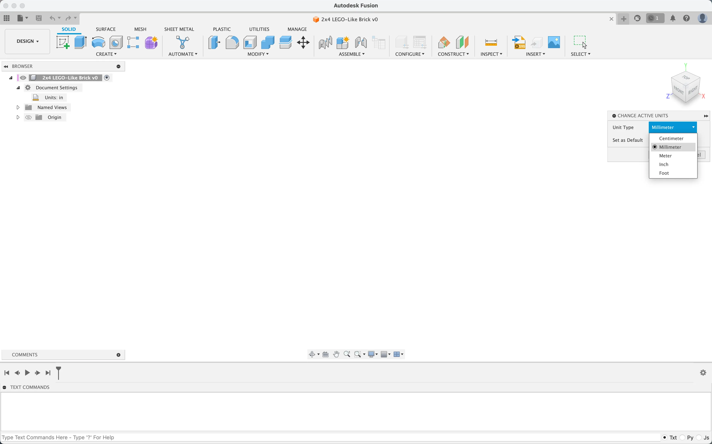
      <div class="click-highlight" aria-hidden="true"></div>
    </div>
  </div>
</div>
```

## 1.4 Save File {.content}

```{=html}
<div class="top-bar">1. SETUP</div>
<div class="screenshot-row" style="
  --highlight-x:4.1%;
  --highlight-y:2.1%;
  --highlight-w:4.8%;
  --highlight-h:6.5%;">
  <div class="callout-box">
    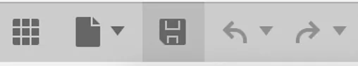
    <div class="callout-label">
      1.4.1: 1. SETUP
    </div>
    <p class="concept-insight"><strong>*</strong> Keep dimensions parametric where possible.</p>
  </div>
  <div class="main-panel">
    <div class="main-shot-wrap">
      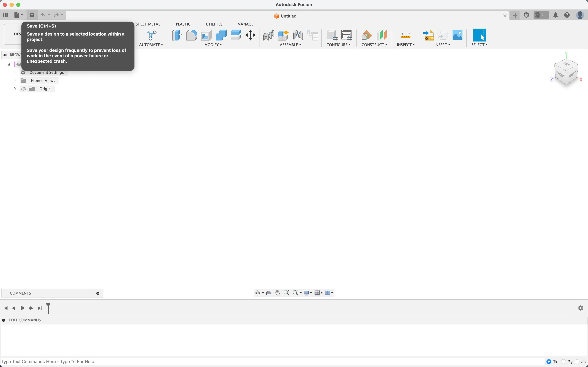
      <div class="click-highlight" aria-hidden="true"></div>
    </div>
  </div>
</div>
```

## 1.5 Name Your File {.content}

```{=html}
<div class="top-bar">1. SETUP</div>
<div class="screenshot-row" style="
  --highlight-x:8.0%;
  --highlight-y:30.5%;
  --highlight-w:84.0%;
  --highlight-h:10.5%;">
  <div class="callout-box">
    
    <div class="callout-label">
      1.5.1: 1. SETUP
    </div>
    <p class="concept-insight"><strong>*</strong> Keep dimensions parametric where possible.</p>
  </div>
  <div class="main-panel">
    <div class="main-shot-wrap">
      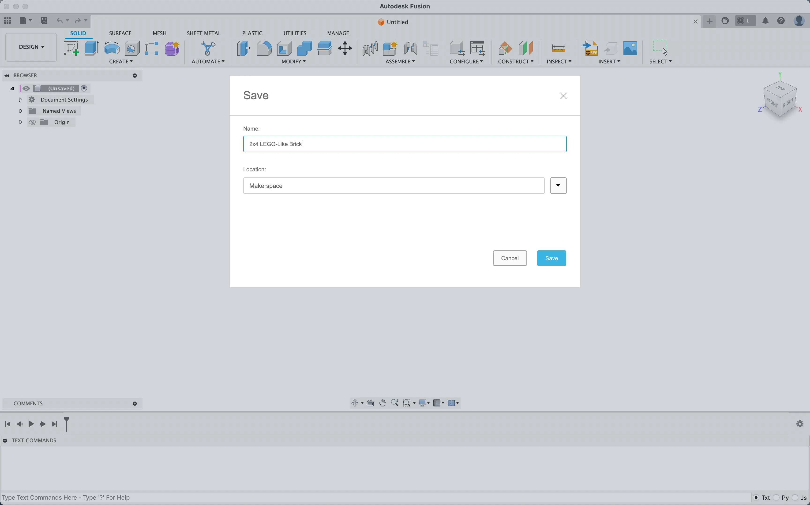
      <div class="click-highlight" aria-hidden="true"></div>
    </div>
  </div>
</div>
```

# 2.0.0 Enter Parameters {.divider}

```{=html}
<div class="left-panel">
  <div class="number">2</div>
  <div class="label">ENTER PARAMETERS</div>
</div>
<div class="right-panel">
  
</div>
```

## 2.1 Change Parameters {.content}

```{=html}
<div class="top-bar">2. ENTER PARAMETERS</div>
<div class="screenshot-row" style="
    --highlight-x:28.5%;
    --highlight-y:55.5%;
    --highlight-w:11.5%;
    --highlight-h:7.0%;">
  <div class="callout-box">
    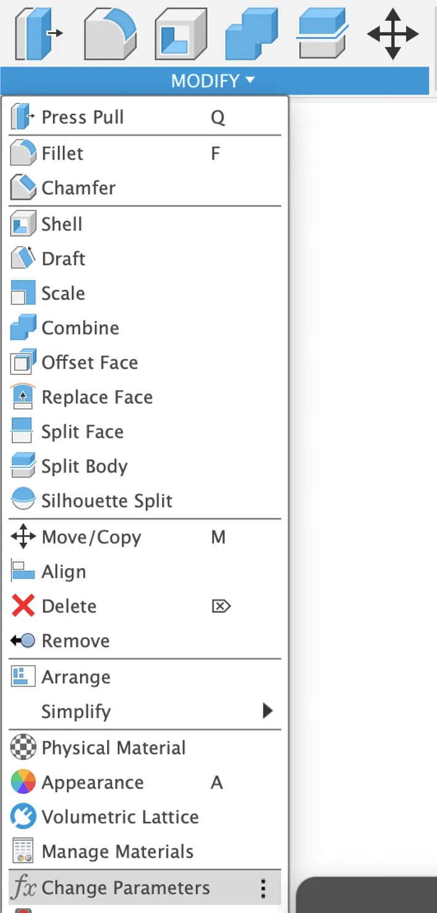
    <div class="callout-label">
      2.1.1: 2. ENTER PARAMETERS
    </div>
    <p class="concept-insight"><strong>*</strong> Keep dimensions parametric where possible.</p>
  </div>
  <div class="main-panel">
    <div class="main-shot-wrap">
      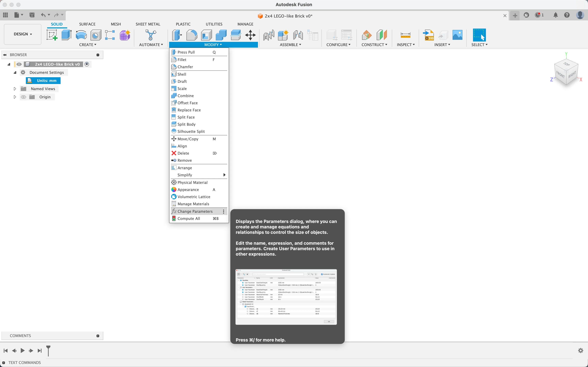
      <div class="click-highlight" aria-hidden="true"></div>
    </div>
  </div>
</div>
```

## 2.2 Add User Parameter {.content}

```{=html}
<div class="top-bar">2. ENTER PARAMETERS</div>
<div class="screenshot-row" style="
    --highlight-x:55.0%;
    --highlight-y:19.0%;
    --highlight-w:3.2%;
    --highlight-h:4.2%;">
  <div class="callout-box">
    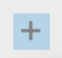
    <div class="callout-label">
      2.2.1: We will be adding a bunch of parameters next 2. ENTER PARAMETERS
    </div>
    <p class="concept-insight"><strong>*</strong> Keep dimensions parametric where possible.</p>
  </div>
  <div class="main-panel">
    <div class="main-shot-wrap">
      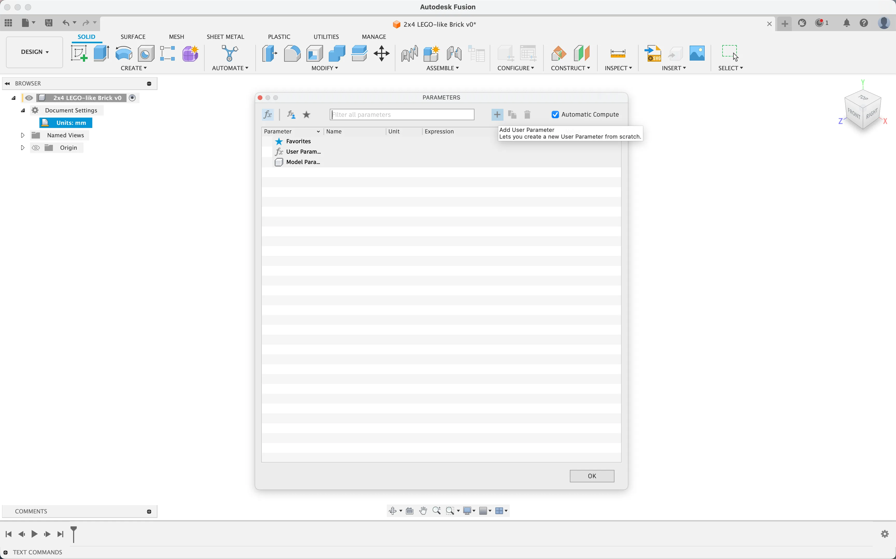
      <div class="click-highlight" aria-hidden="true"></div>
    </div>
  </div>
</div>
```

## 2.3 Add “length” Parameter {.content}
<!-- curriculum-ref: parametric-design.define-named-parameter.fusion -->

```{=html}
<div class="top-bar">2. ENTER PARAMETERS</div>
<div class="screenshot-row" style="
    --highlight-x:38.5%;
    --highlight-y:36.0%;
    --highlight-w:23.5%;
    --highlight-h:30.0%;">
  <div class="callout-box">
    
    <div class="callout-label">
      2.3.1: 2. ENTER PARAMETERS
    </div>
    <p class="concept-insight"><strong>*</strong> Keep dimensions parametric where possible.</p>
  </div>
  <div class="main-panel">
    <div class="main-shot-wrap">
      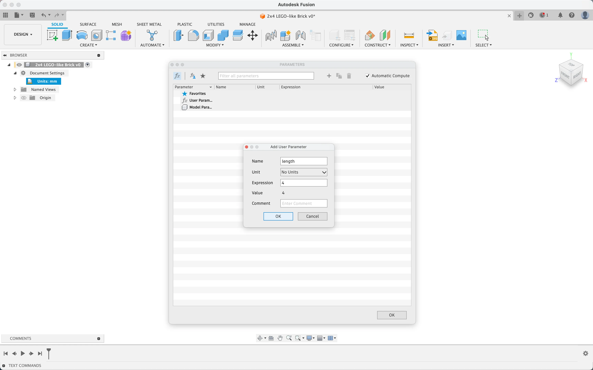
      <div class="click-highlight" aria-hidden="true"></div>
    </div>
  </div>
</div>
```

## 2.4 Add {.content}

```{=html}
<div class="top-bar">2. ENTER PARAMETERS</div>
<div class="screenshot-row" style="
    --highlight-x:38.5%;
    --highlight-y:36.0%;
    --highlight-w:23.5%;
    --highlight-h:30.0%;">
  <div class="callout-box">
    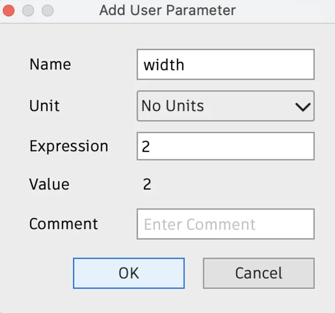
    <div class="callout-label">
      2.4.1: ”width” Parameter 2. ENTER PARAMETERS
    </div>
    <p class="concept-insight"><strong>*</strong> Keep dimensions parametric where possible.</p>
  </div>
  <div class="main-panel">
    <div class="main-shot-wrap">
      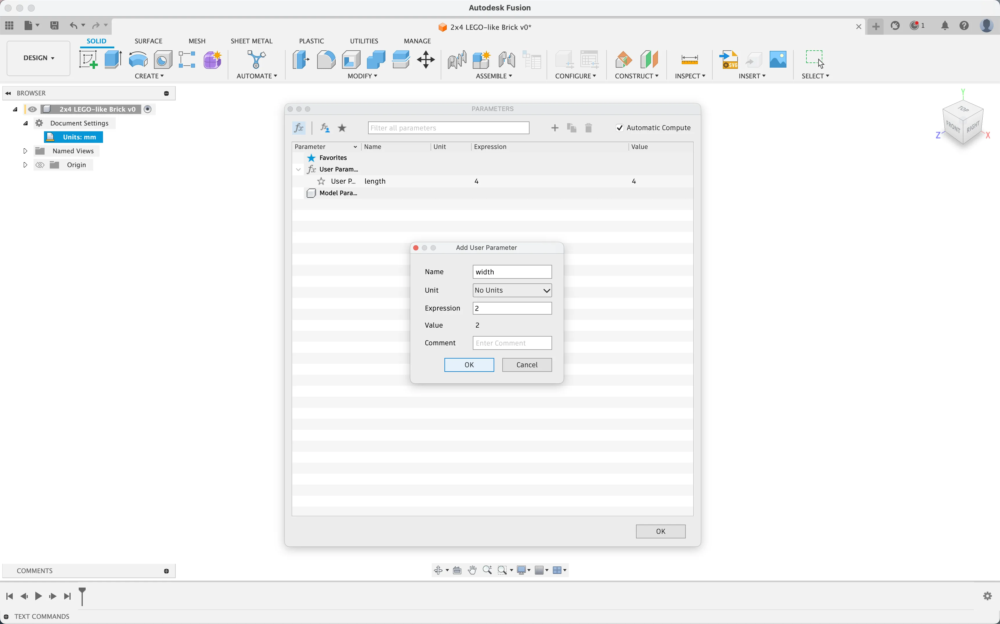
      <div class="click-highlight" aria-hidden="true"></div>
    </div>
  </div>
</div>
```

## 2.5 Add {.content}

```{=html}
<div class="top-bar">2. ENTER PARAMETERS</div>
<div class="screenshot-row" style="
    --highlight-x:38.5%;
    --highlight-y:36.0%;
    --highlight-w:23.5%;
    --highlight-h:30.0%;">
  <div class="callout-box">
    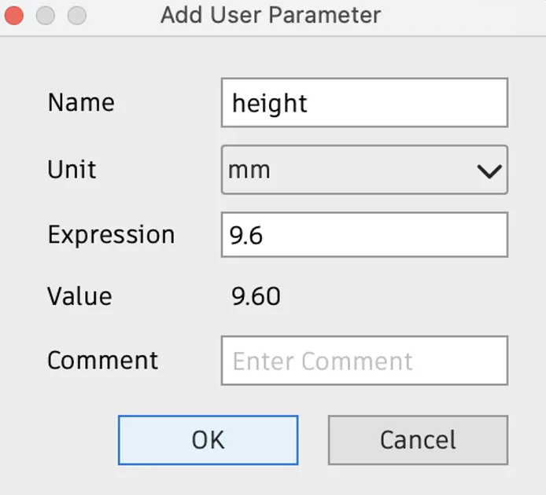
    <div class="callout-label">
      2.5.1: “height” Parameter 2. ENTER PARAMETERS
    </div>
    <p class="concept-insight"><strong>*</strong> Keep dimensions parametric where possible.</p>
  </div>
  <div class="main-panel">
    <div class="main-shot-wrap">
      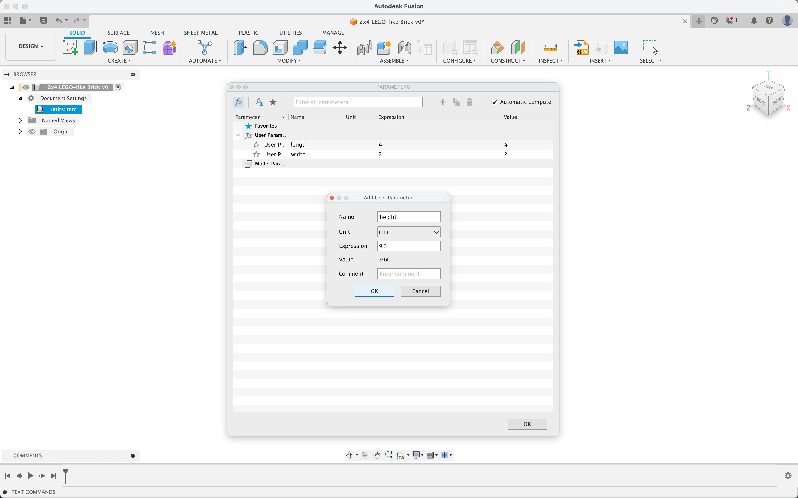
      <div class="click-highlight" aria-hidden="true"></div>
    </div>
  </div>
</div>
```

## 2.6 Add {.content}

```{=html}
<div class="top-bar">2. ENTER PARAMETERS</div>
<div class="screenshot-row" style="
    --highlight-x:38.5%;
    --highlight-y:36.0%;
    --highlight-w:23.5%;
    --highlight-h:30.0%;">
  <div class="callout-box">
    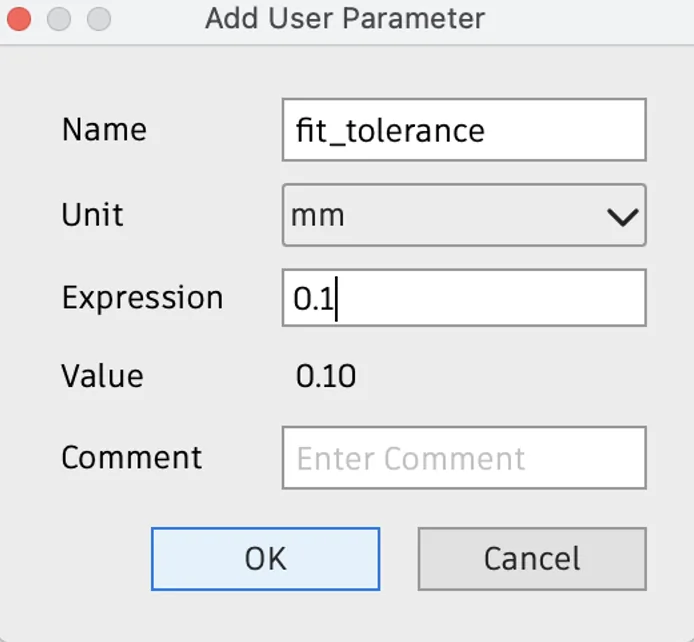
    <div class="callout-label">
      2.6.1: “ fit_tolerance ” 2. ENTER PARAMETERS
    </div>
    <p class="concept-insight"><strong>*</strong> Keep dimensions parametric where possible.</p>
  </div>
  <div class="main-panel">
    <div class="main-shot-wrap">
      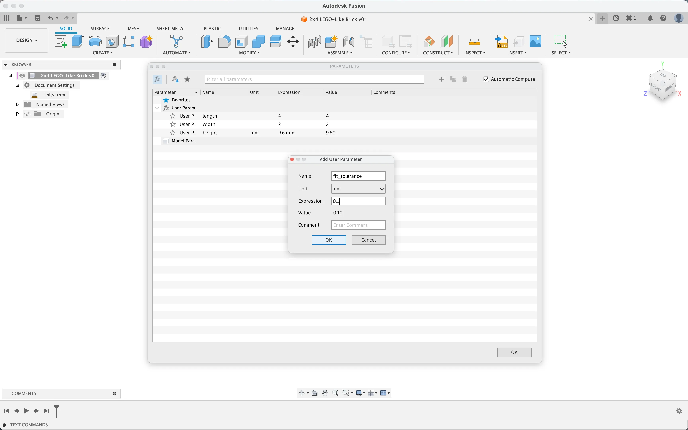
      <div class="click-highlight" aria-hidden="true"></div>
    </div>
  </div>
</div>
```

## 2.7 Favorite Parameters {.content}

```{=html}
<div class="top-bar">2. ENTER PARAMETERS</div>
<div class="screenshot-row" style="
    --highlight-x:24.0%;
    --highlight-y:30.5%;
    --highlight-w:52.0%;
    --highlight-h:16.5%;">
  <div class="callout-box">
    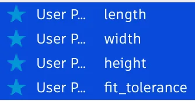
    <div class="callout-label">
      2.7.1: These are the main parameters that we will use to create different LEGO-LIKE brick sizes Favorite them to keep them easily acessible 2. ENTER PARAMETERS
    </div>
    <p class="concept-insight"><strong>*</strong> Keep dimensions parametric where possible.</p>
  </div>
  <div class="main-panel">
    <div class="main-shot-wrap">
      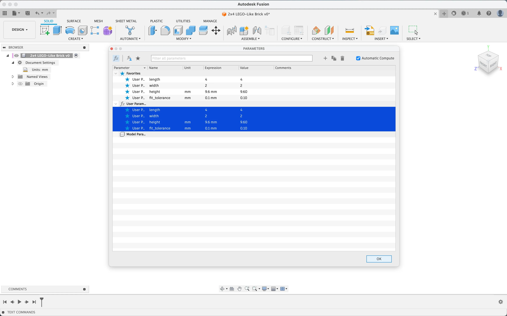
      <div class="click-highlight" aria-hidden="true"></div>
    </div>
  </div>
</div>
```

## 2.8 Add {.content}

```{=html}
<div class="top-bar">2. ENTER PARAMETERS</div>
<div class="screenshot-row" style="
    --highlight-x:38.5%;
    --highlight-y:36.0%;
    --highlight-w:23.5%;
    --highlight-h:30.0%;">
  <div class="callout-box">
    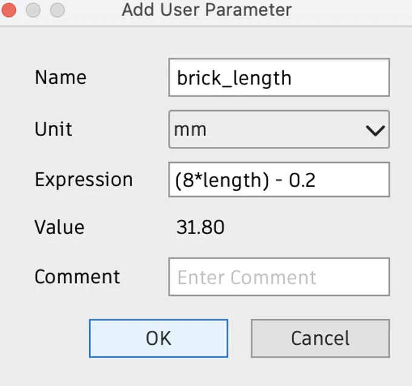
    <div class="callout-label">
      2.8.1: ” brick_length ” Here we can use expressions that reference other parameters like “length” (8mm between studs * amount of studs on brick length) – 0.2mm fit tolerance to allow bricks to fit side by side 2. ENTER PARAMETERS
    </div>
    <p class="concept-insight"><strong>*</strong> Keep dimensions parametric where possible.</p>
  </div>
  <div class="main-panel">
    <div class="main-shot-wrap">
      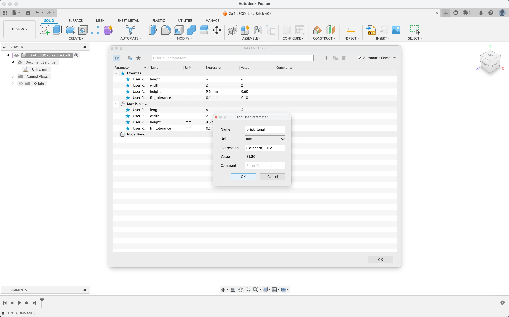
      <div class="click-highlight" aria-hidden="true"></div>
    </div>
  </div>
</div>
```

## 2.9 Now use a similar expression for the brick width {.content}

```{=html}
<div class="top-bar">2. ENTER PARAMETERS</div>
<div class="screenshot-row" style="
    --highlight-x:38.5%;
    --highlight-y:36.0%;
    --highlight-w:23.5%;
    --highlight-h:30.0%;">
  <div class="callout-box">
    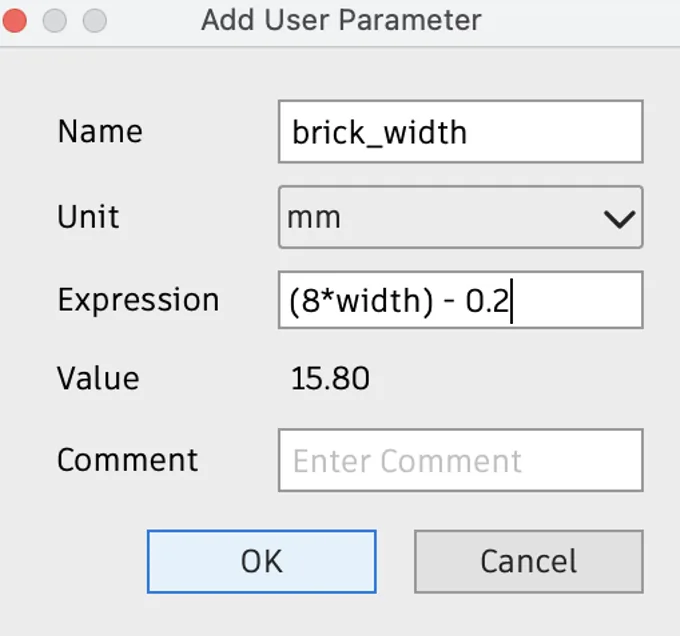
    <div class="callout-label">
      2.9.1: Add “ brick_width ” 2. ENTER PARAMETERS
    </div>
    <p class="concept-insight"><strong>*</strong> Keep dimensions parametric where possible.</p>
  </div>
  <div class="main-panel">
    <div class="main-shot-wrap">
      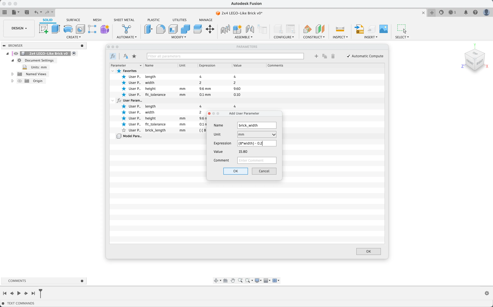
      <div class="click-highlight" aria-hidden="true"></div>
    </div>
  </div>
</div>
```

## 2.10 Add in the rest of the parameters for the studs {.content}

```{=html}
<div class="top-bar">2. ENTER PARAMETERS</div>
<div class="screenshot-row" style="
    --highlight-x:23.0%;
    --highlight-y:39.0%;
    --highlight-w:53.0%;
    --highlight-h:17.5%;">
  <div class="callout-box">
    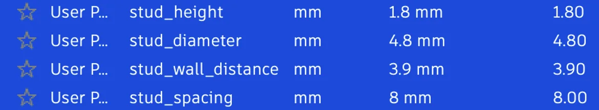
    <div class="callout-label">
      2.10.1: Add Stud Parameters 2. ENTER PARAMETERS
    </div>
    <p class="concept-insight"><strong>*</strong> Keep dimensions parametric where possible.</p>
  </div>
  <div class="main-panel">
    <div class="main-shot-wrap">
      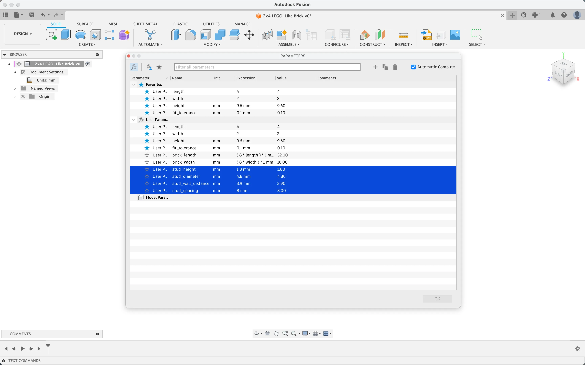
      <div class="click-highlight" aria-hidden="true"></div>
    </div>
  </div>
</div>
```

## 2.11 Double Check {.content}

```{=html}
<div class="top-bar">2. ENTER PARAMETERS</div>
<div class="screenshot-row" style="
    --highlight-x:10.0%;
    --highlight-y:22.0%;
    --highlight-w:72.0%;
    --highlight-h:53.0%;">
  <div class="callout-box">
    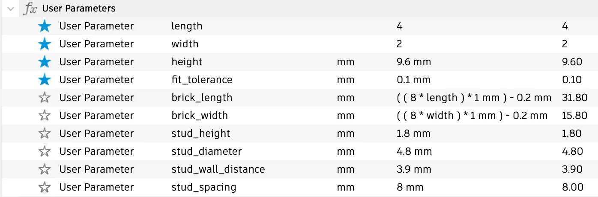
    <div class="callout-label">
      2.11.1: Double check that your parameters match These will be used to dimension the brick 2. ENTER PARAMETERS
    </div>
    <p class="concept-insight"><strong>*</strong> Keep dimensions parametric where possible.</p>
  </div>
  <div class="main-panel">
    <div class="main-shot-wrap">
      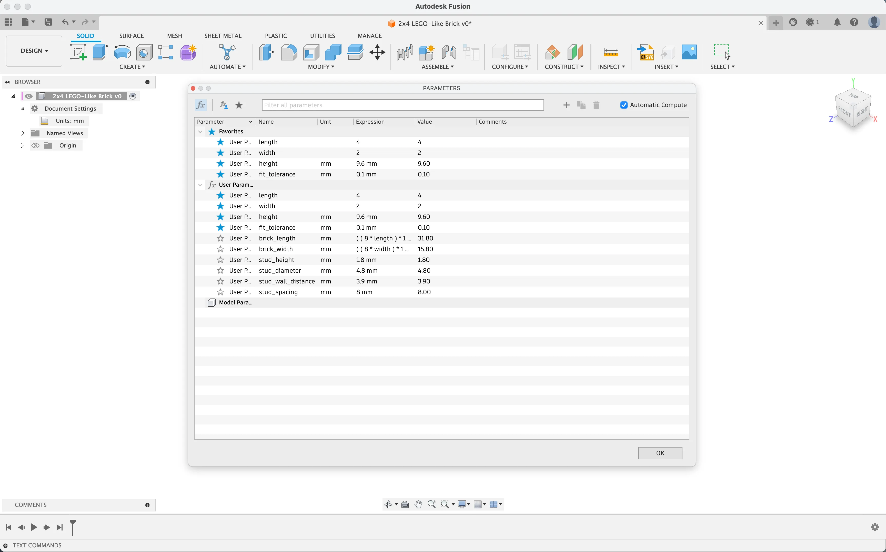
      <div class="click-highlight" aria-hidden="true"></div>
    </div>
  </div>
</div>
```

# 3.0.0 Make The Brick {.divider}

```{=html}
<div class="left-panel">
  <div class="number">3</div>
  <div class="label">MAKE THE BRICK</div>
</div>
<div class="right-panel">
  
</div>
```

## 3.1 Create Sketch {.content}

```{=html}
<div class="top-bar">3. MAKE THE BRICK</div>
<div class="screenshot-row" style="
    --highlight-x:6.2%;
    --highlight-y:4.0%;
    --highlight-w:5.6%;
    --highlight-h:7.0%;">
  <div class="callout-box">
    
    <div class="callout-label">
      3.1.1: 3. MAKE THE BRICK
    </div>
    <p class="concept-insight"><strong>*</strong> Keep dimensions parametric where possible.</p>
  </div>
  <div class="main-panel">
    <div class="main-shot-wrap">
      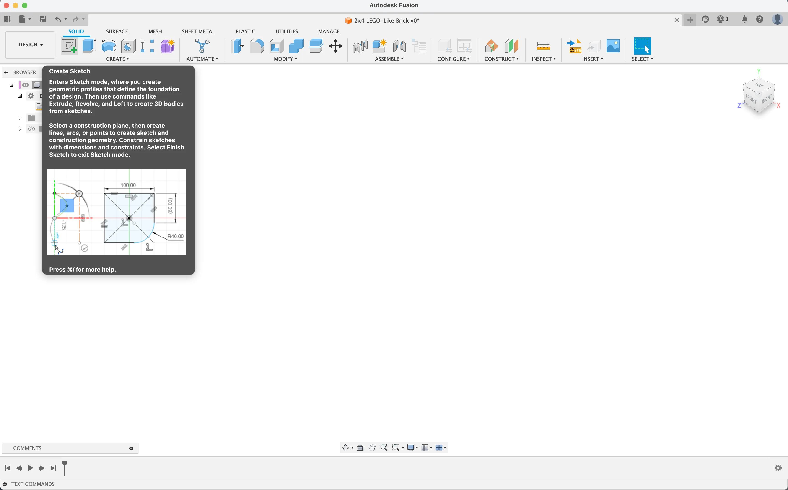
      <div class="click-highlight" aria-hidden="true"></div>
    </div>
  </div>
</div>
```

## 3.2 Select Bottom Plane {.content}

```{=html}
<div class="top-bar">3. MAKE THE BRICK</div>
<div class="screenshot-row" style="
    --highlight-x:44.0%;
    --highlight-y:44.0%;
    --highlight-w:12.5%;
    --highlight-h:18.0%;">
  <div class="callout-box">
    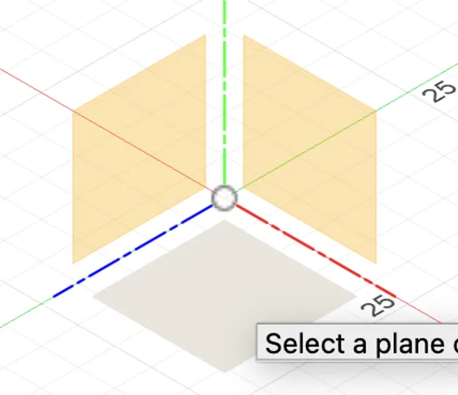
    <div class="callout-label">
      3.2.1: 3. MAKE THE BRICK
    </div>
    <p class="concept-insight"><strong>*</strong> Keep dimensions parametric where possible.</p>
  </div>
  <div class="main-panel">
    <div class="main-shot-wrap">
      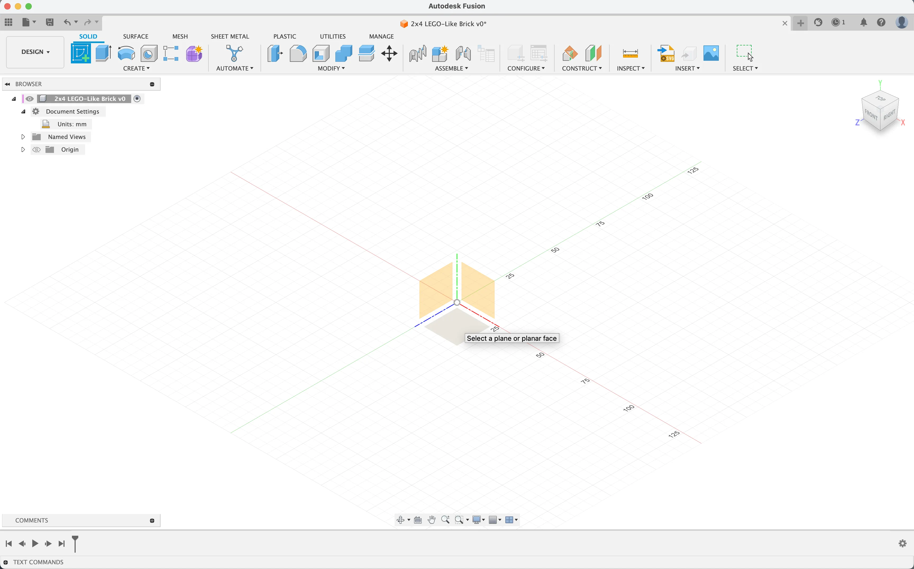
      <div class="click-highlight" aria-hidden="true"></div>
    </div>
  </div>
</div>
```

## 3.3 Select Rectangle Tool {.content}

```{=html}
<div class="top-bar">3. MAKE THE BRICK</div>
<div class="screenshot-row" style="
    --highlight-x:20.0%;
    --highlight-y:7.0%;
    --highlight-w:5.2%;
    --highlight-h:7.0%;">
  <div class="callout-box">
    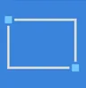
    <div class="callout-label">
      3.3.1: 3. MAKE THE BRICK
    </div>
    <p class="concept-insight"><strong>*</strong> Keep dimensions parametric where possible.</p>
  </div>
  <div class="main-panel">
    <div class="main-shot-wrap">
      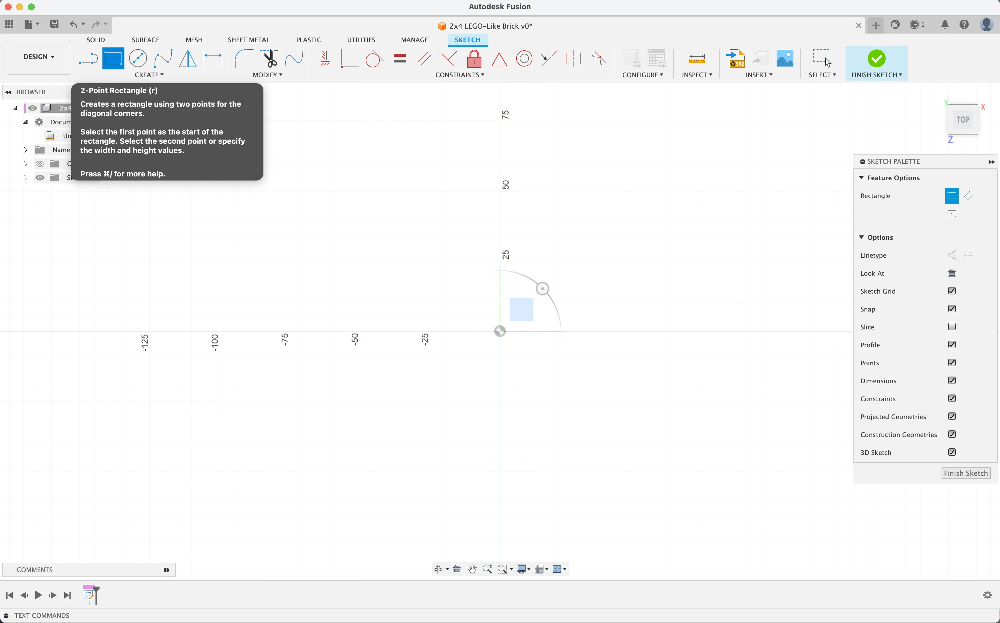
      <div class="click-highlight" aria-hidden="true"></div>
    </div>
  </div>
</div>
```

## 3.4 Select Center Rectangle {.content}

```{=html}
<div class="top-bar">3. MAKE THE BRICK</div>
<div class="screenshot-row" style="
    --highlight-x:93.8%;
    --highlight-y:25.0%;
    --highlight-w:5.8%;
    --highlight-h:7.2%;">
  <div class="callout-box">
    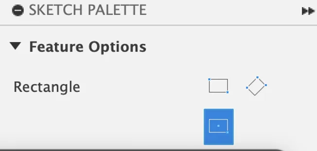
    <div class="callout-label">
      3.4.1: 3. MAKE THE BRICK
    </div>
    <p class="concept-insight"><strong>*</strong> Keep dimensions parametric where possible.</p>
  </div>
  <div class="main-panel">
    <div class="main-shot-wrap">
      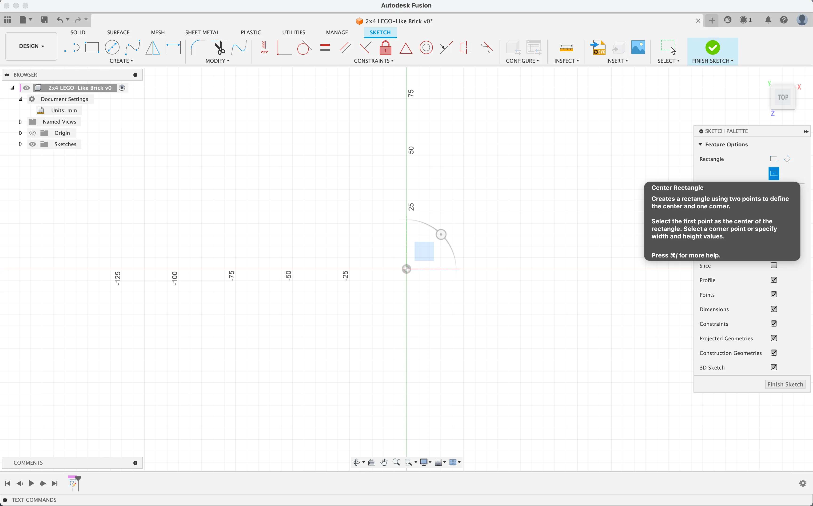
      <div class="click-highlight" aria-hidden="true"></div>
    </div>
  </div>
</div>
```

## 3.5 Create Rectangle {.content}

```{=html}
<div class="top-bar">3. MAKE THE BRICK</div>
<div class="screenshot-row" style="
    --highlight-x:61.8%;
    --highlight-y:21.0%;
    --highlight-w:8.0%;
    --highlight-h:10.5%;">
  <div class="callout-box">
    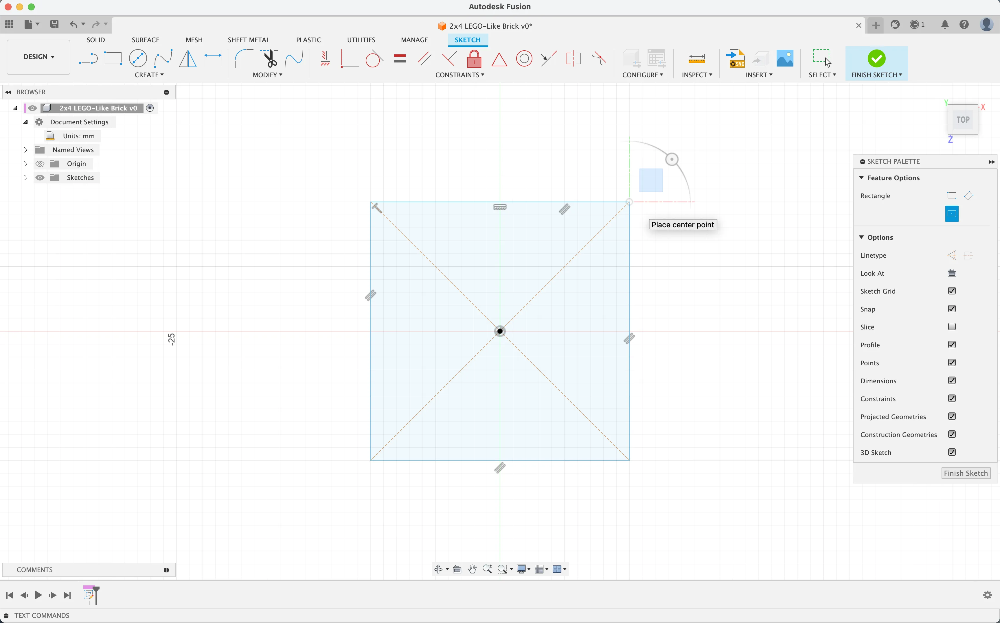
    <div class="callout-label">
      3.5.1: Click on center point then click on another point to create a rectangle We will dimension it next 3. MAKE THE BRICK 1 2
    </div>
    <p class="concept-insight"><strong>*</strong> Keep dimensions parametric where possible.</p>
  </div>
  <div class="main-panel">
    <div class="main-shot-wrap">
      
      <div class="click-highlight" aria-hidden="true"></div>
    </div>
  </div>
</div>
```

## 3.6 Select Dimension Tool {.content}

```{=html}
<div class="top-bar">3. MAKE THE BRICK</div>
<div class="screenshot-row" style="
    --highlight-x:21.0%;
    --highlight-y:7.0%;
    --highlight-w:5.0%;
    --highlight-h:7.2%;">
  <div class="callout-box">
    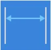
    <div class="callout-label">
      3.6.1: 3. MAKE THE BRICK
    </div>
    <p class="concept-insight"><strong>*</strong> Keep dimensions parametric where possible.</p>
  </div>
  <div class="main-panel">
    <div class="main-shot-wrap">
      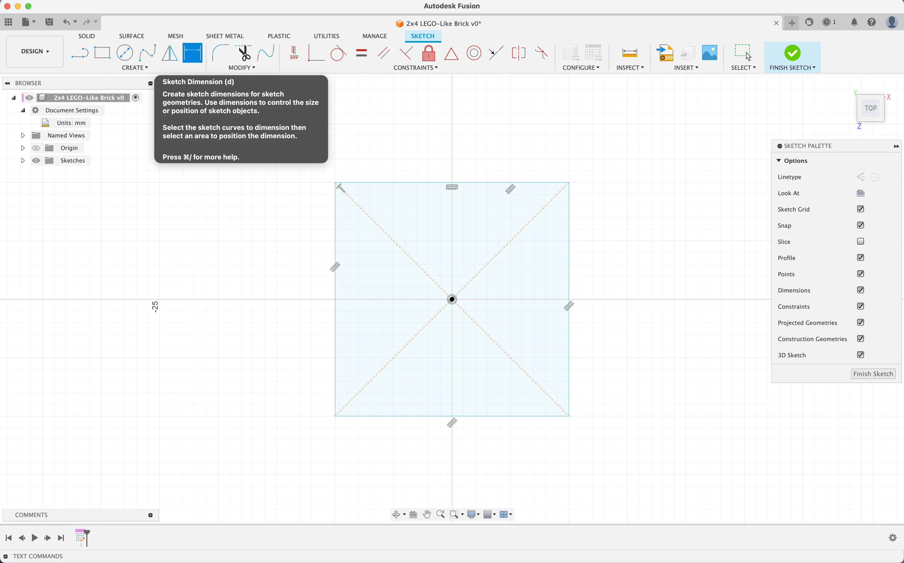
      <div class="click-highlight" aria-hidden="true"></div>
    </div>
  </div>
</div>
```

## 3.7 Dimension Brick Length {.content}

```{=html}
<div class="top-bar">3. MAKE THE BRICK</div>
<div class="screenshot-row" style="
    --highlight-x:48.0%;
    --highlight-y:10.0%;
    --highlight-w:24.0%;
    --highlight-h:12.0%;">
  <div class="callout-box">
    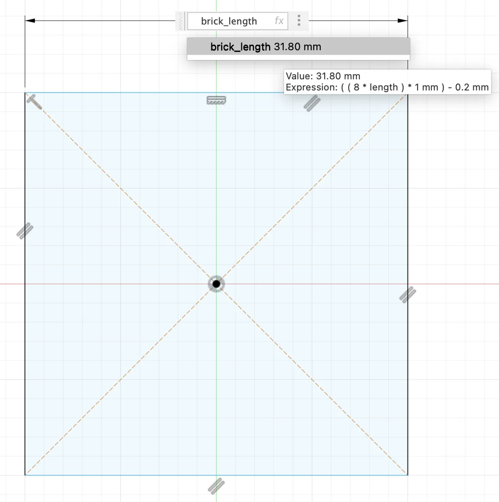
    <div class="callout-label">
      3.7.1: Click on the top edge and enter “ brick_length ” as dimension 3. MAKE THE BRICK 2 2 1 1
    </div>
    <p class="concept-insight"><strong>*</strong> Keep dimensions parametric where possible.</p>
  </div>
  <div class="main-panel">
    <div class="main-shot-wrap">
      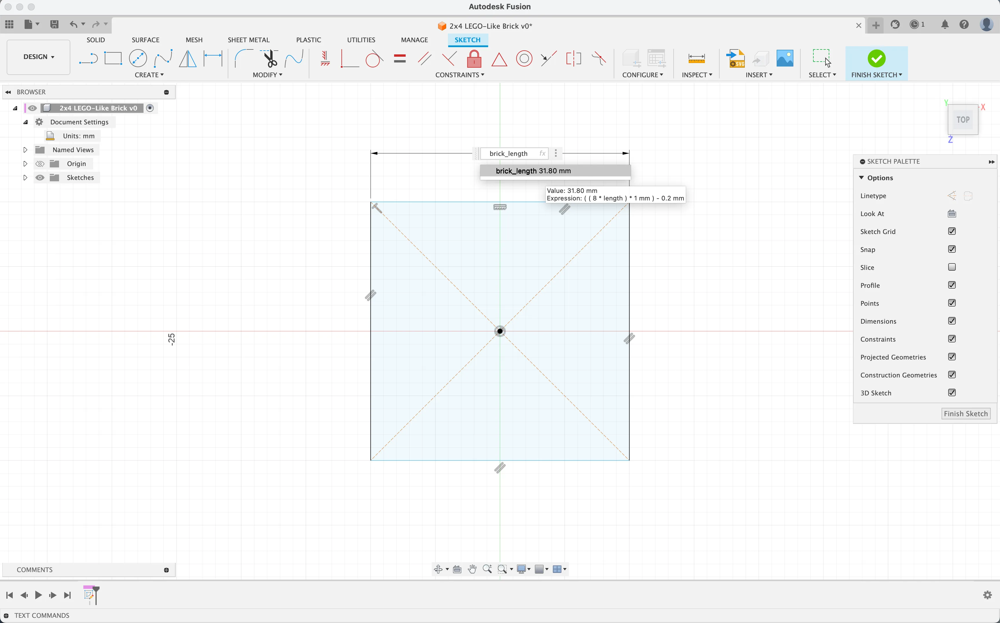
      <div class="click-highlight" aria-hidden="true"></div>
    </div>
  </div>
</div>
```

## 3.8 Dimension Brick Width {.content}

```{=html}
<div class="top-bar">3. MAKE THE BRICK</div>
<div class="screenshot-row" style="
    --highlight-x:31.0%;
    --highlight-y:33.0%;
    --highlight-w:16.0%;
    --highlight-h:24.0%;">
  <div class="callout-box">
    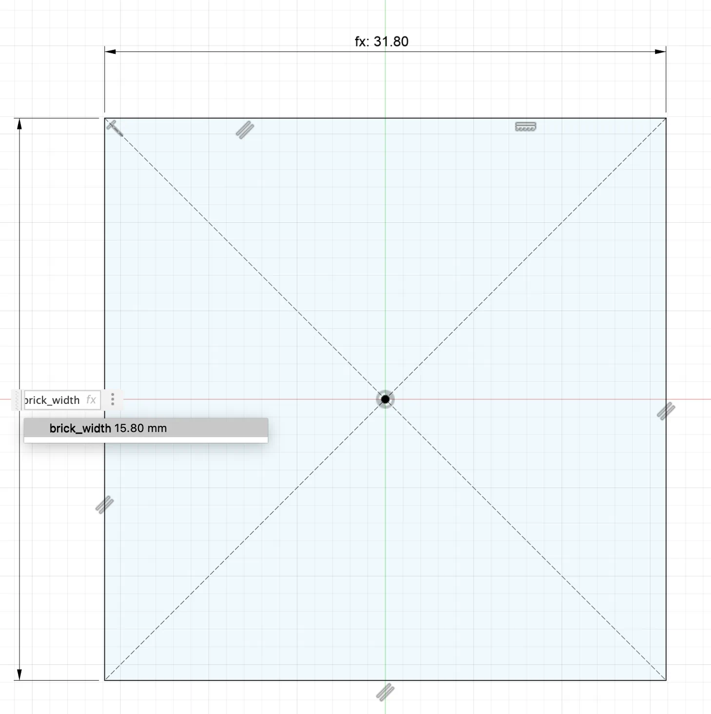
    <div class="callout-label">
      3.8.1: Click on left edge and enter ” brick_width ” as dimension 3. MAKE THE BRICK 2 2 1 1
    </div>
    <p class="concept-insight"><strong>*</strong> Keep dimensions parametric where possible.</p>
  </div>
  <div class="main-panel">
    <div class="main-shot-wrap">
      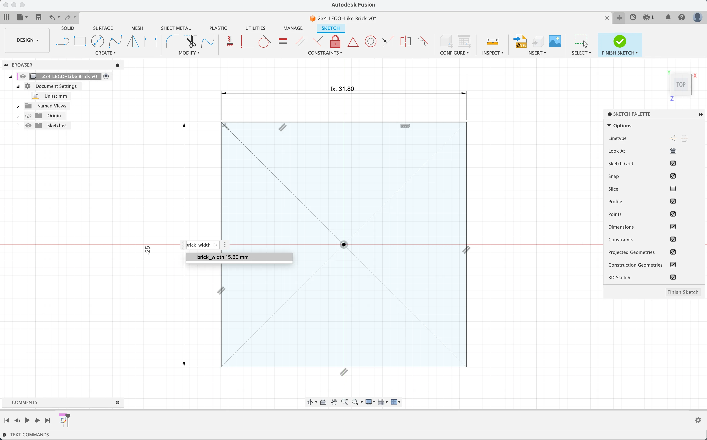
      <div class="click-highlight" aria-hidden="true"></div>
    </div>
  </div>
</div>
```

## 3.9 Finish Sketch {.content}

```{=html}
<div class="top-bar">3. MAKE THE BRICK</div>
<div class="screenshot-row" style="
    --highlight-x:85.5%;
    --highlight-y:2.2%;
    --highlight-w:13.0%;
    --highlight-h:7.0%;">
  <div class="callout-box">
    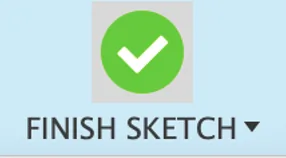
    <div class="callout-label">
      3.9.1: Click “FINISH SKETCH” to exit the sketch menu 3. MAKE THE BRICK
    </div>
    <p class="concept-insight"><strong>*</strong> Keep dimensions parametric where possible.</p>
  </div>
  <div class="main-panel">
    <div class="main-shot-wrap">
      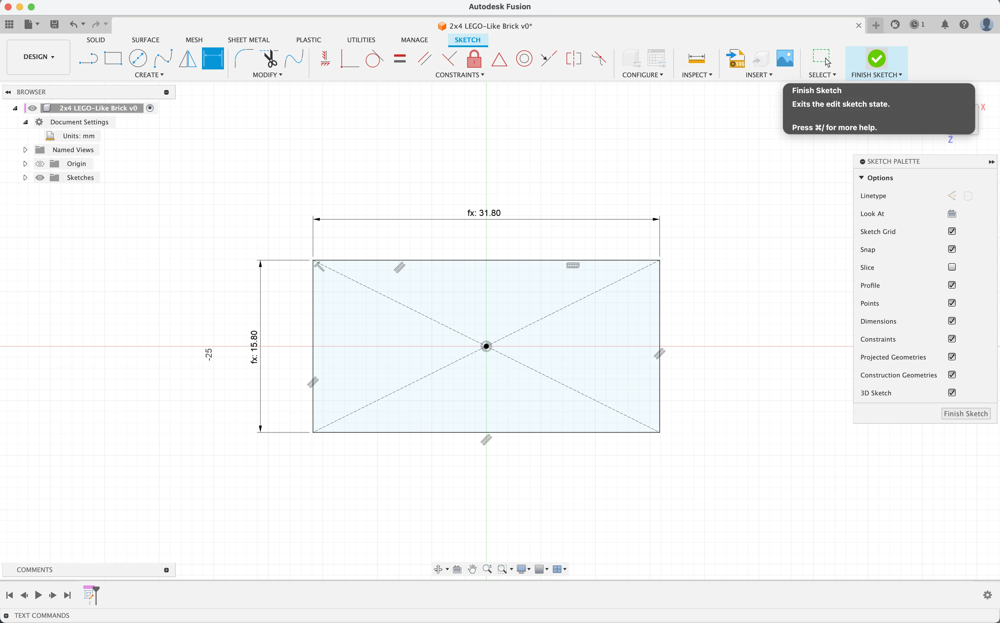
      <div class="click-highlight" aria-hidden="true"></div>
    </div>
  </div>
</div>
```

## 3.10 Select {.content}

```{=html}
<div class="top-bar">3. MAKE THE BRICK</div>
<div class="screenshot-row" style="
    --highlight-x:93.5%;
    --highlight-y:8.0%;
    --highlight-w:6.0%;
    --highlight-h:10.0%;">
  <div class="callout-box">
    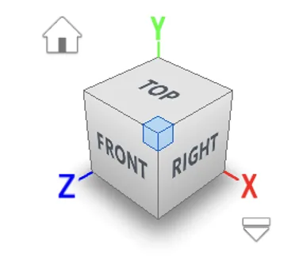
    <div class="callout-label">
      3.10.1: a better view 3. MAKE THE BRICK
    </div>
    <p class="concept-insight"><strong>*</strong> Keep dimensions parametric where possible.</p>
  </div>
  <div class="main-panel">
    <div class="main-shot-wrap">
      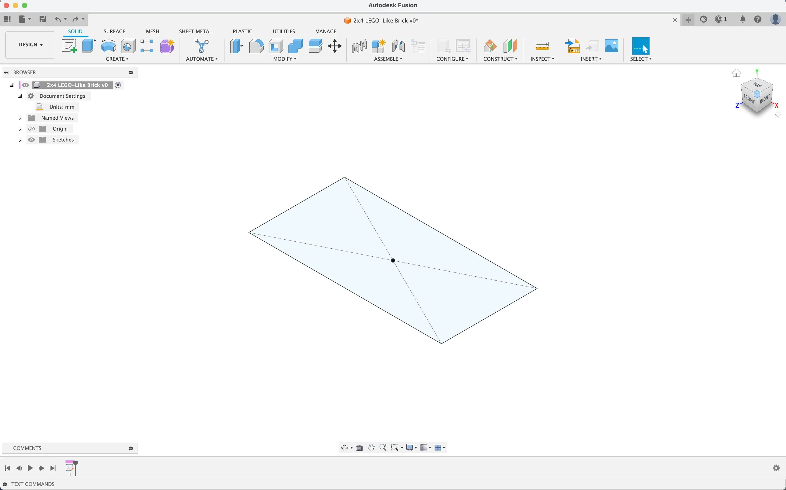
      <div class="click-highlight" aria-hidden="true"></div>
    </div>
  </div>
</div>
```

## 3.11 Select the Sketch {.content}

```{=html}
<div class="top-bar">3. MAKE THE BRICK</div>
<div class="screenshot-row" style="
    --highlight-x:0.8%;
    --highlight-y:14.0%;
    --highlight-w:15.5%;
    --highlight-h:19.0%;">
  <div class="callout-box">
    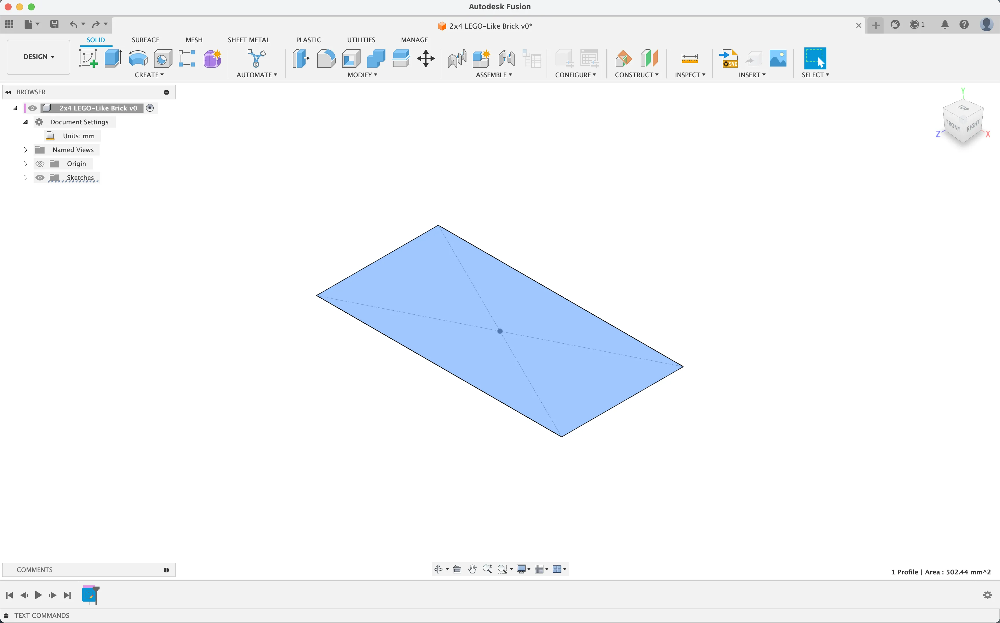
    <div class="callout-label">
      3.11.1: Click the rectangle we drew 3. MAKE THE BRICK
    </div>
    <p class="concept-insight"><strong>*</strong> Keep dimensions parametric where possible.</p>
  </div>
  <div class="main-panel">
    <div class="main-shot-wrap">
      
      <div class="click-highlight" aria-hidden="true"></div>
    </div>
  </div>
</div>
```

## 3.12 Select Extrude Tool {.content}

```{=html}
<div class="top-bar">3. MAKE THE BRICK</div>
<div class="screenshot-row" style="
    --highlight-x:33.8%;
    --highlight-y:7.5%;
    --highlight-w:5.8%;
    --highlight-h:7.5%;">
  <div class="callout-box">
    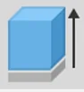
    <div class="callout-label">
      3.12.1: 3. MAKE THE BRICK
    </div>
    <p class="concept-insight"><strong>*</strong> Keep dimensions parametric where possible.</p>
  </div>
  <div class="main-panel">
    <div class="main-shot-wrap">
      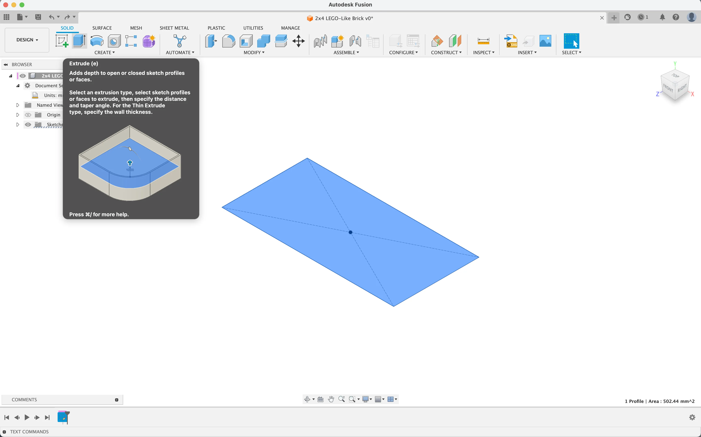
      <div class="click-highlight" aria-hidden="true"></div>
    </div>
  </div>
</div>
```

## 3.13 Set Distance as “height” {.content}

```{=html}
<div class="top-bar">3. MAKE THE BRICK</div>
<div class="screenshot-row" style="
    --highlight-x:82.5%;
    --highlight-y:24.0%;
    --highlight-w:16.0%;
    --highlight-h:30.0%;">
  <div class="callout-box">
    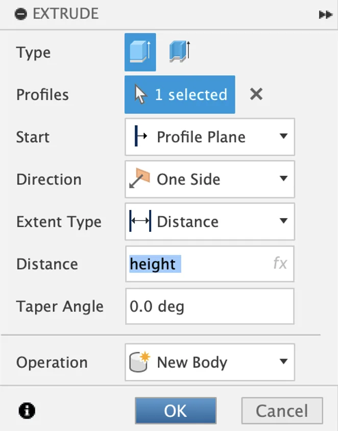
    <div class="callout-label">
      3.13.1: 3. MAKE THE BRICK
    </div>
    <p class="concept-insight"><strong>*</strong> Keep dimensions parametric where possible.</p>
  </div>
  <div class="main-panel">
    <div class="main-shot-wrap">
      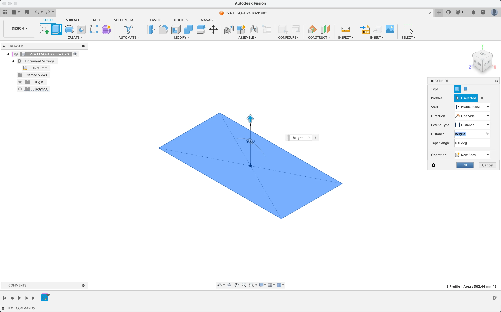
      <div class="click-highlight" aria-hidden="true"></div>
    </div>
  </div>
</div>
```

## 3.14 We Have a Brick! {.content}

```{=html}
<div class="top-bar">3. MAKE THE BRICK</div>
<div class="screenshot-row" style="
    --highlight-x:47.0%;
    --highlight-y:89.0%;
    --highlight-w:22.0%;
    --highlight-h:8.0%;">
  <div class="callout-box">
    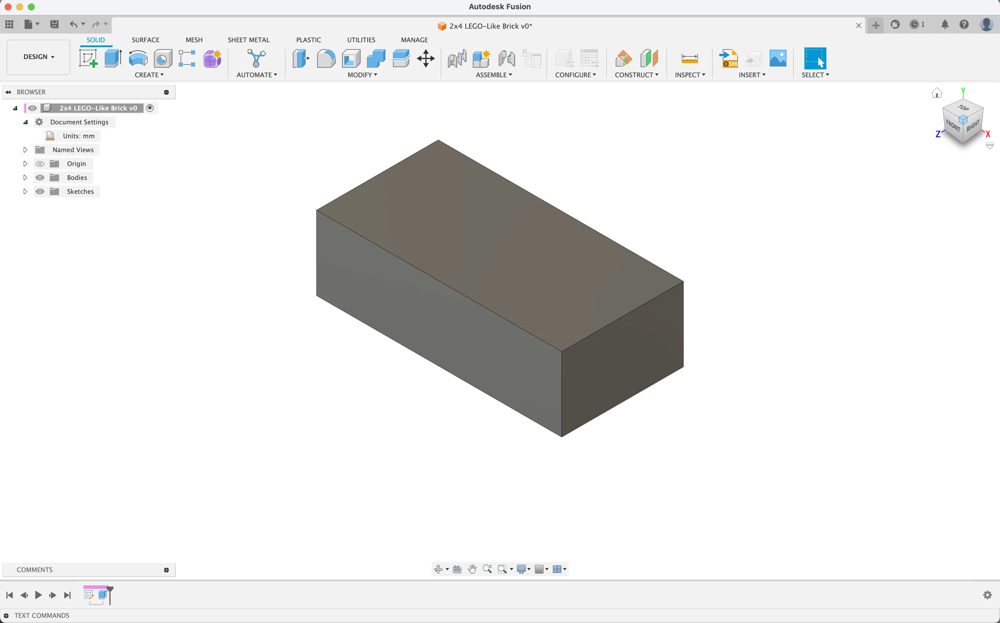
    <div class="callout-label">
      3.14.1: If you need to make adjustments, you can edit the sketch or extrusion feature by right clicking either one in the timeline and selecting “edit” 3. MAKE THE BRICK
    </div>
    <p class="concept-insight"><strong>*</strong> Keep dimensions parametric where possible.</p>
  </div>
  <div class="main-panel">
    <div class="main-shot-wrap">
      
      <div class="click-highlight" aria-hidden="true"></div>
    </div>
  </div>
</div>
```

# 4.0.0 Make A Top Stud {.divider}

```{=html}
<div class="left-panel">
  <div class="number">4</div>
  <div class="label">MAKE A TOP STUD</div>
</div>
<div class="right-panel">
  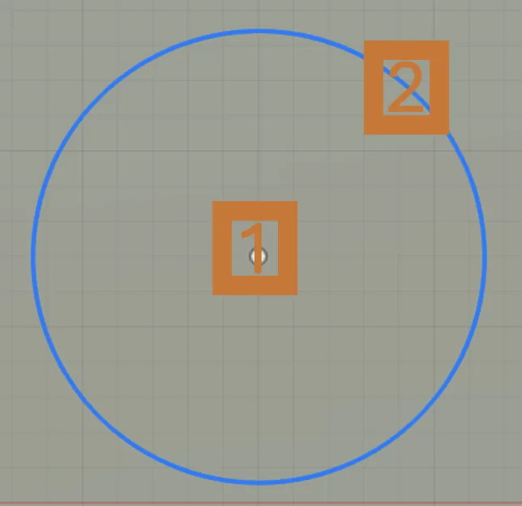
</div>
```

## 4.1 Create a Sketch {.content}

```{=html}
<div class="top-bar">4. MAKE A TOP STUD</div>
<div class="screenshot-row" style="
    --highlight-x:6.2%;
    --highlight-y:4.0%;
    --highlight-w:5.6%;
    --highlight-h:7.0%;">
  <div class="callout-box">
    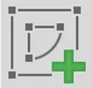
    <div class="callout-label">
      4.1.1: 4. MAKE A TOP STUD
    </div>
    <p class="concept-insight"><strong>*</strong> Keep dimensions parametric where possible.</p>
  </div>
  <div class="main-panel">
    <div class="main-shot-wrap">
      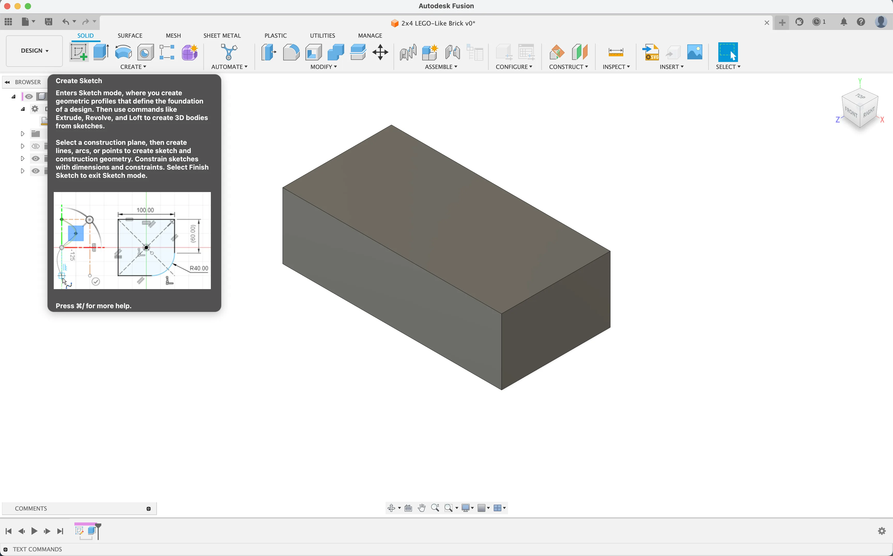
      <div class="click-highlight" aria-hidden="true"></div>
    </div>
  </div>
</div>
```

## 4.2 Select the Top Face of the Brick {.content}

```{=html}
<div class="top-bar">4. MAKE A TOP STUD</div>
<div class="screenshot-row" style="
    --highlight-x:44.0%;
    --highlight-y:39.0%;
    --highlight-w:14.0%;
    --highlight-h:18.0%;">
  <div class="callout-box">
    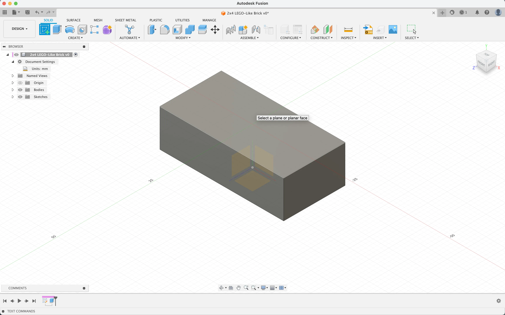
    <div class="callout-label">
      4.2.1: 4. MAKE A TOP STUD
    </div>
    <p class="concept-insight"><strong>*</strong> Keep dimensions parametric where possible.</p>
  </div>
  <div class="main-panel">
    <div class="main-shot-wrap">
      
      <div class="click-highlight" aria-hidden="true"></div>
    </div>
  </div>
</div>
```

## 4.3 Select the Circle Tool {.content}

```{=html}
<div class="top-bar">4. MAKE A TOP STUD</div>
<div class="screenshot-row" style="
    --highlight-x:20.0%;
    --highlight-y:7.0%;
    --highlight-w:5.2%;
    --highlight-h:7.0%;">
  <div class="callout-box">
    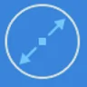
    <div class="callout-label">
      4.3.1: 4. MAKE A TOP STUD
    </div>
    <p class="concept-insight"><strong>*</strong> Keep dimensions parametric where possible.</p>
  </div>
  <div class="main-panel">
    <div class="main-shot-wrap">
      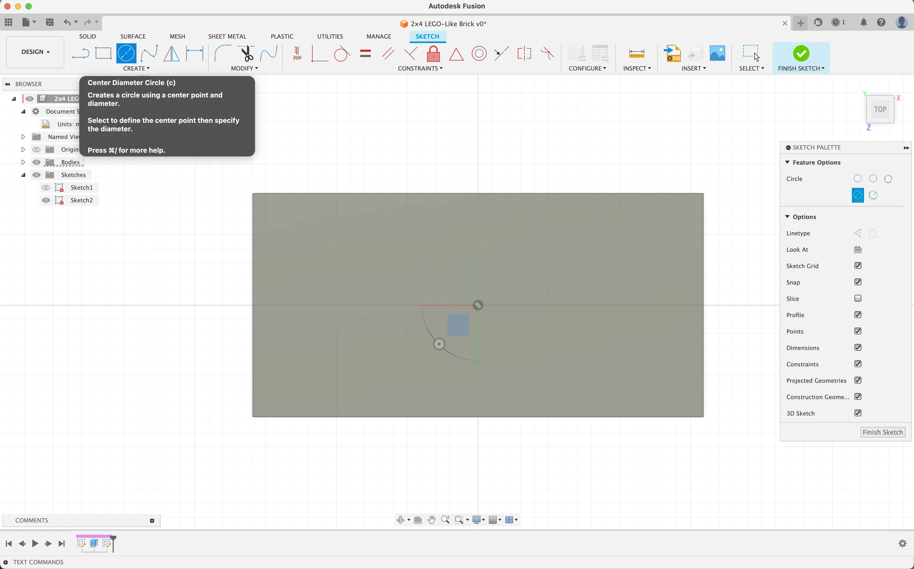
      <div class="click-highlight" aria-hidden="true"></div>
    </div>
  </div>
</div>
```

## 4.4 Create a Circle {.content}

```{=html}
<div class="top-bar">4. MAKE A TOP STUD</div>
<div class="screenshot-row" style="
    --highlight-x:30.0%;
    --highlight-y:28.0%;
    --highlight-w:8.0%;
    --highlight-h:10.0%;">
  <div class="callout-box">
    
    <div class="callout-label">
      4.4.1: Click once for the center point and again for the radius distance Place this near the top left corner of the rectangle. We will dimension next 4. MAKE A TOP STUD 1 2
    </div>
    <p class="concept-insight"><strong>*</strong> Keep dimensions parametric where possible.</p>
  </div>
  <div class="main-panel">
    <div class="main-shot-wrap">
      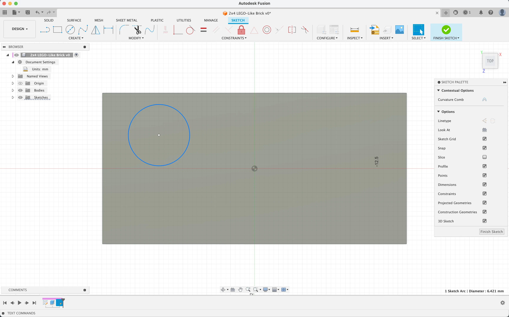
      <div class="click-highlight" aria-hidden="true"></div>
    </div>
  </div>
</div>
```

## 4.5 Click the Dimension Tool {.content}

```{=html}
<div class="top-bar">4. MAKE A TOP STUD</div>
<div class="screenshot-row" style="
    --highlight-x:21.0%;
    --highlight-y:7.0%;
    --highlight-w:5.0%;
    --highlight-h:7.2%;">
  <div class="callout-box">
    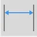
    <div class="callout-label">
      4.5.1: 4. MAKE A TOP STUD
    </div>
    <p class="concept-insight"><strong>*</strong> Keep dimensions parametric where possible.</p>
  </div>
  <div class="main-panel">
    <div class="main-shot-wrap">
      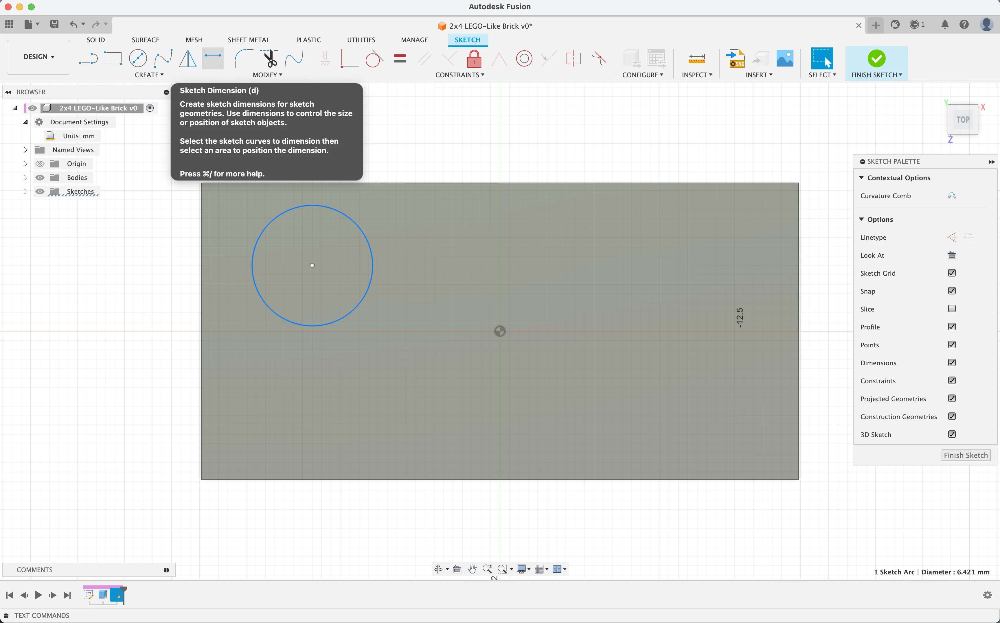
      <div class="click-highlight" aria-hidden="true"></div>
    </div>
  </div>
</div>
```

## 4.6 Dimension Circle {.content}

```{=html}
<div class="top-bar">4. MAKE A TOP STUD</div>
<div class="screenshot-row" style="
    --highlight-x:39.0%;
    --highlight-y:31.0%;
    --highlight-w:16.0%;
    --highlight-h:18.0%;">
  <div class="callout-box">
    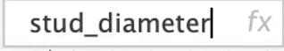
    <div class="callout-label">
      4.6.1: Click the Circle and enter “stud_diameter” 4. MAKE A TOP STUD
    </div>
    <p class="concept-insight"><strong>*</strong> Keep dimensions parametric where possible.</p>
  </div>
  <div class="main-panel">
    <div class="main-shot-wrap">
      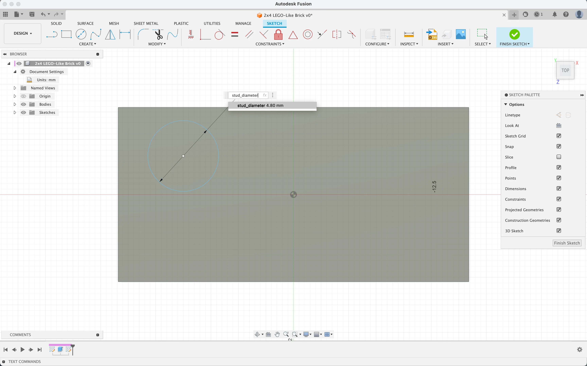
      <div class="click-highlight" aria-hidden="true"></div>
    </div>
  </div>
</div>
```

## 4.7 Dimension Left Wall Distance {.content}

```{=html}
<div class="top-bar">4. MAKE A TOP STUD</div>
<div class="screenshot-row" style="
    --highlight-x:24.0%;
    --highlight-y:28.0%;
    --highlight-w:22.0%;
    --highlight-h:24.0%;">
  <div class="callout-box">
    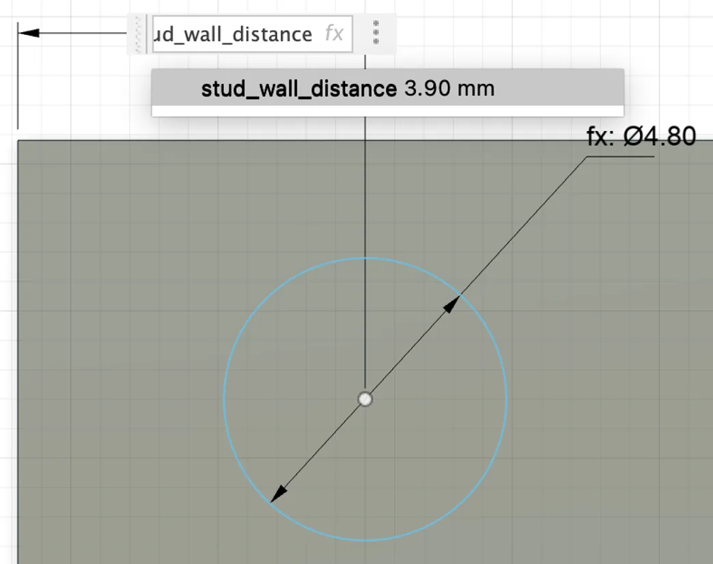
    <div class="callout-label">
      4.7.1: Click the left wall line and the center of the circle Enter “ stud_wall_distance ” 4. MAKE A TOP STUD 3 2 1 1 2 3
    </div>
    <p class="concept-insight"><strong>*</strong> Keep dimensions parametric where possible.</p>
  </div>
  <div class="main-panel">
    <div class="main-shot-wrap">
      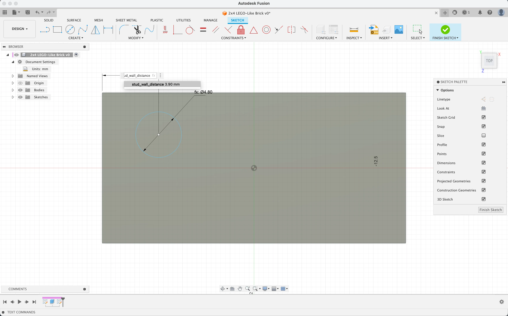
      <div class="click-highlight" aria-hidden="true"></div>
    </div>
  </div>
</div>
```

## 4.8 Dimension Upper Wall Distance {.content}

```{=html}
<div class="top-bar">4. MAKE A TOP STUD</div>
<div class="screenshot-row" style="
    --highlight-x:28.0%;
    --highlight-y:21.0%;
    --highlight-w:24.0%;
    --highlight-h:20.0%;">
  <div class="callout-box">
    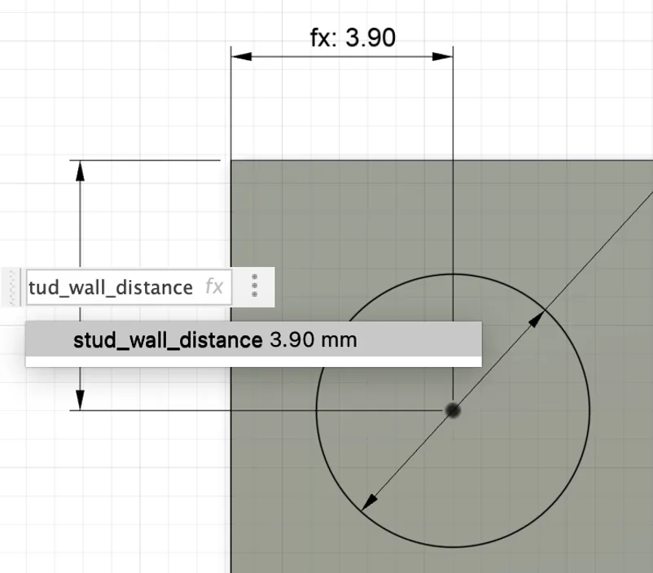
    <div class="callout-label">
      4.8.1: Click on the upper wall line and the center of the circle Enter “ stud_wall_distance ” 4. MAKE A TOP STUD 3 2 1 1 2 3
    </div>
    <p class="concept-insight"><strong>*</strong> Keep dimensions parametric where possible.</p>
  </div>
  <div class="main-panel">
    <div class="main-shot-wrap">
      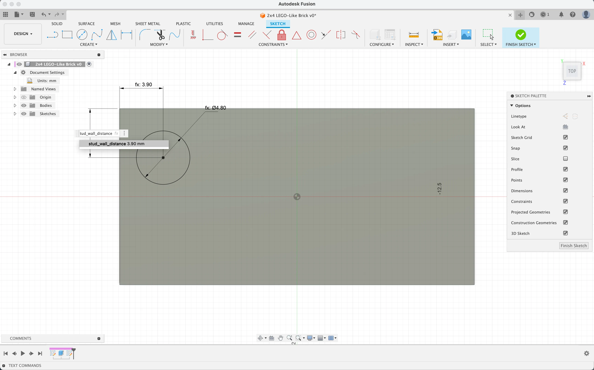
      <div class="click-highlight" aria-hidden="true"></div>
    </div>
  </div>
</div>
```

## 4.9 Finish Sketch {.content}

```{=html}
<div class="top-bar">4. MAKE A TOP STUD</div>
<div class="screenshot-row" style="
    --highlight-x:85.0%;
    --highlight-y:2.2%;
    --highlight-w:13.0%;
    --highlight-h:7.0%;">
  <div class="callout-box">
    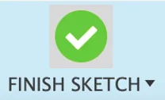
    <div class="callout-label">
      4.9.1: 4. MAKE A TOP STUD
    </div>
    <p class="concept-insight"><strong>*</strong> Keep dimensions parametric where possible.</p>
  </div>
  <div class="main-panel">
    <div class="main-shot-wrap">
      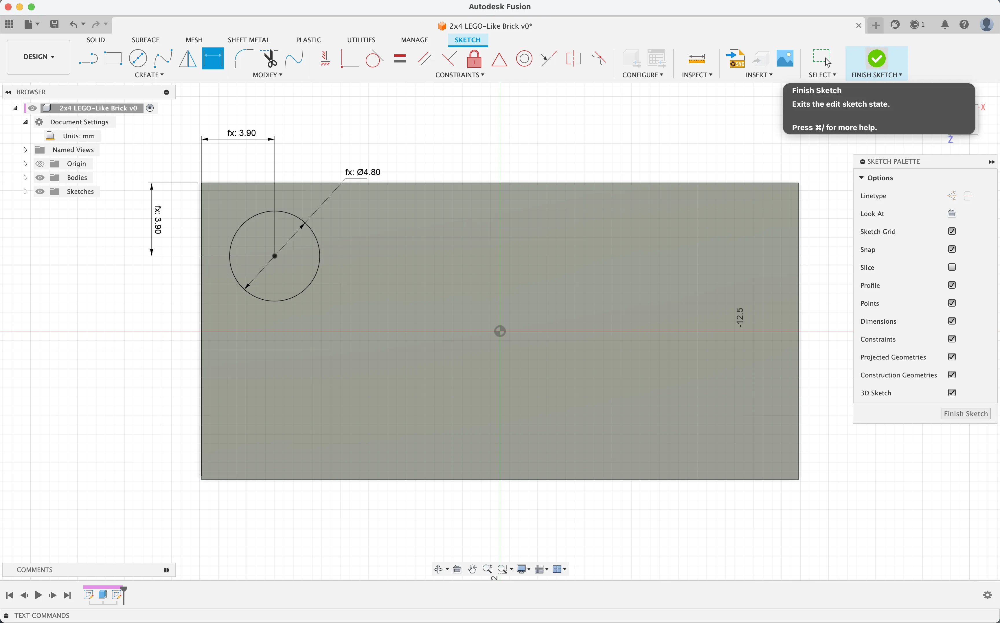
      <div class="click-highlight" aria-hidden="true"></div>
    </div>
  </div>
</div>
```

## 4.10 Get a Better View {.content}

```{=html}
<div class="top-bar">4. MAKE A TOP STUD</div>
<div class="screenshot-row" style="
    --highlight-x:93.5%;
    --highlight-y:8.0%;
    --highlight-w:6.0%;
    --highlight-h:10.0%;">
  <div class="callout-box">
    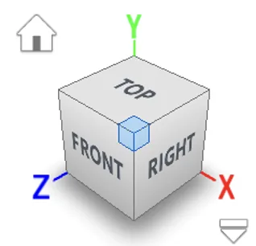
    <div class="callout-label">
      4.10.1: 4. MAKE A TOP STUD
    </div>
    <p class="concept-insight"><strong>*</strong> Keep dimensions parametric where possible.</p>
  </div>
  <div class="main-panel">
    <div class="main-shot-wrap">
      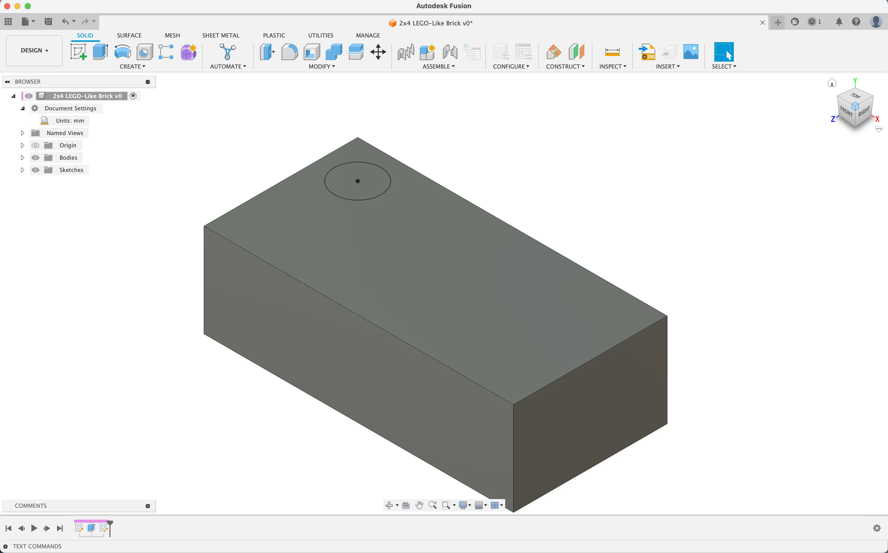
      <div class="click-highlight" aria-hidden="true"></div>
    </div>
  </div>
</div>
```

## 4.11 Select the Extrude Tool {.content}

```{=html}
<div class="top-bar">4. MAKE A TOP STUD</div>
<div class="screenshot-row" style="
    --highlight-x:33.8%;
    --highlight-y:7.5%;
    --highlight-w:5.8%;
    --highlight-h:7.5%;">
  <div class="callout-box">
    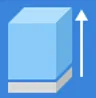
    <div class="callout-label">
      4.11.1: 4. MAKE A TOP STUD
    </div>
    <p class="concept-insight"><strong>*</strong> Keep dimensions parametric where possible.</p>
  </div>
  <div class="main-panel">
    <div class="main-shot-wrap">
      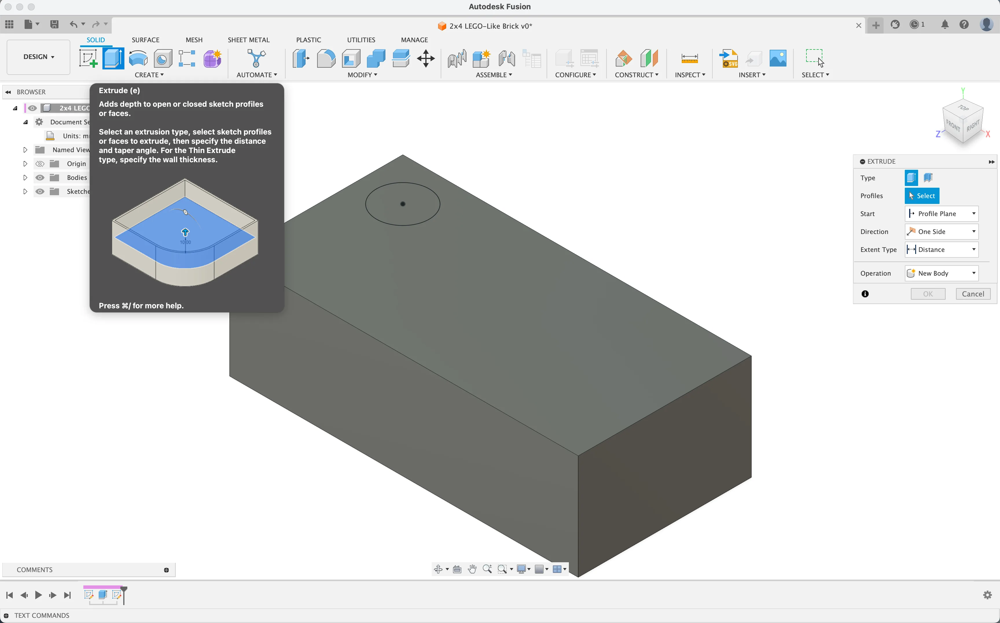
      <div class="click-highlight" aria-hidden="true"></div>
    </div>
  </div>
</div>
```

## 4.12 Select the Circl {.content}

```{=html}
<div class="top-bar">4. MAKE A TOP STUD</div>
<div class="screenshot-row" style="
    --highlight-x:38.0%;
    --highlight-y:33.0%;
    --highlight-w:10.0%;
    --highlight-h:12.0%;">
  <div class="callout-box">
    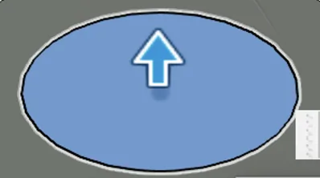
    <div class="callout-label">
      4.12.1: e Sketch 4. MAKE A TOP STUD
    </div>
    <p class="concept-insight"><strong>*</strong> Keep dimensions parametric where possible.</p>
  </div>
  <div class="main-panel">
    <div class="main-shot-wrap">
      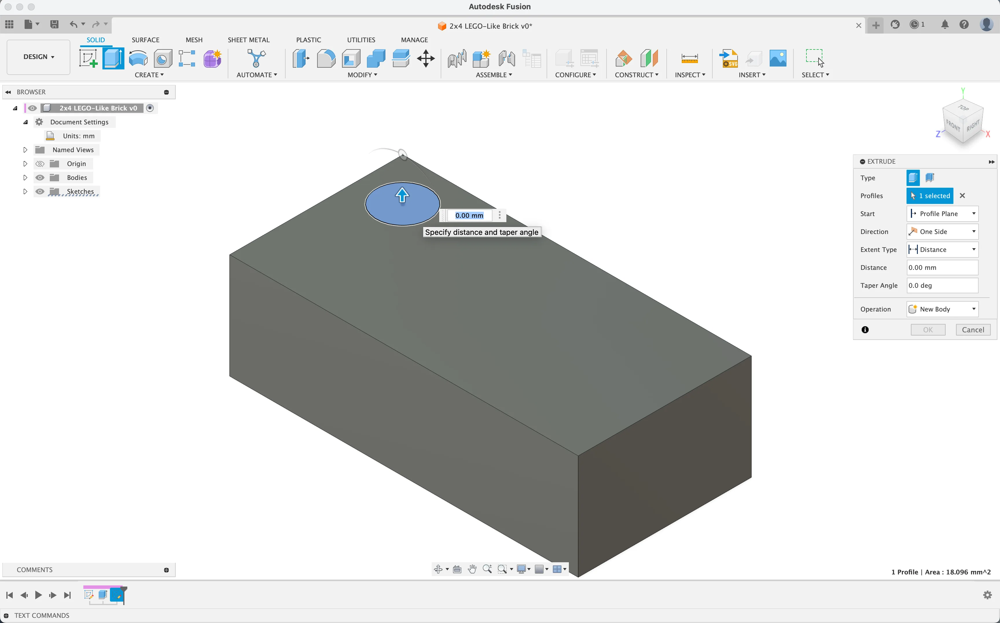
      <div class="click-highlight" aria-hidden="true"></div>
    </div>
  </div>
</div>
```

## 4.13 Set Distance {.content}

```{=html}
<div class="top-bar">4. MAKE A TOP STUD</div>
<div class="screenshot-row" style="
    --highlight-x:82.5%;
    --highlight-y:24.0%;
    --highlight-w:16.0%;
    --highlight-h:30.0%;">
  <div class="callout-box">
    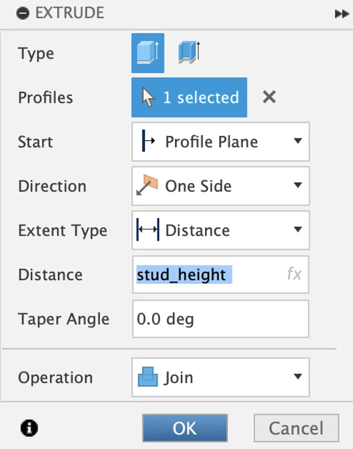
    <div class="callout-label">
      4.13.1: Set distance to ” stud_height ” 4. MAKE A TOP STUD
    </div>
    <p class="concept-insight"><strong>*</strong> Keep dimensions parametric where possible.</p>
  </div>
  <div class="main-panel">
    <div class="main-shot-wrap">
      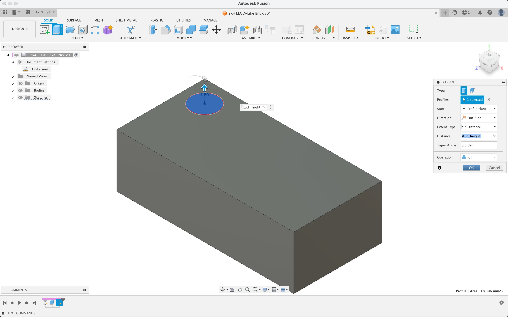
      <div class="click-highlight" aria-hidden="true"></div>
    </div>
  </div>
</div>
```

# 5.0.0 Make A Bottom Stud {.divider}

```{=html}
<div class="left-panel">
  <div class="number">5</div>
  <div class="label">MAKE A BOTTOM STUD</div>
</div>
<div class="right-panel">
  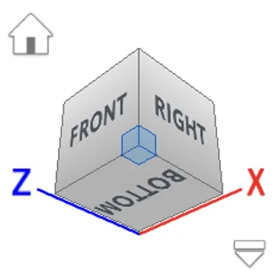
</div>
```

## 5.1 Get a Better View {.content}

```{=html}
<div class="top-bar">5. MAKE A BOTTOM STUD</div>
<div class="screenshot-row" style="
    --highlight-x:93.5%;
    --highlight-y:8.0%;
    --highlight-w:6.0%;
    --highlight-h:10.0%;">
  <div class="callout-box">
    
    <div class="callout-label">
      5.1.1: 5. MAKE A BOTTOM STUD
    </div>
    <p class="concept-insight"><strong>*</strong> Keep dimensions parametric where possible.</p>
  </div>
  <div class="main-panel">
    <div class="main-shot-wrap">
      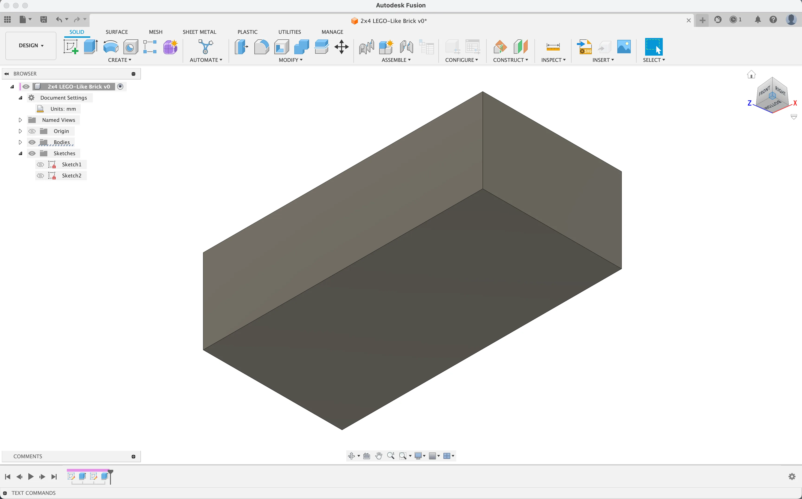
      <div class="click-highlight" aria-hidden="true"></div>
    </div>
  </div>
</div>
```

## 5.2 Create Sketch on Bottom Surface {.content}

```{=html}
<div class="top-bar">5. MAKE A BOTTOM STUD</div>
<div class="screenshot-row" style="
    --highlight-x:43.0%;
    --highlight-y:53.0%;
    --highlight-w:14.0%;
    --highlight-h:18.0%;">
  <div class="callout-box">
    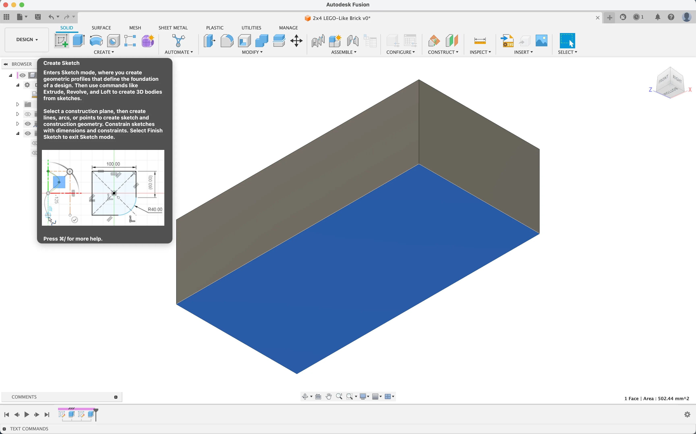
    <div class="callout-label">
      5.2.1: Click “Create Sketch” Click on bottom surface of the brick 5. MAKE A BOTTOM STUD 2
    </div>
    <p class="concept-insight"><strong>*</strong> Keep dimensions parametric where possible.</p>
  </div>
  <div class="main-panel">
    <div class="main-shot-wrap">
      
      <div class="click-highlight" aria-hidden="true"></div>
    </div>
  </div>
</div>
```

## 5.3 Unhide Sketch 2 {.content}

```{=html}
<div class="top-bar">5. MAKE A BOTTOM STUD</div>
<div class="screenshot-row" style="
    --highlight-x:5.0%;
    --highlight-y:34.0%;
    --highlight-w:7.0%;
    --highlight-h:4.0%;">
  <div class="callout-box">
    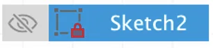
    <div class="callout-label">
      5.3.1: Unhide the sketch we made for the top stud We will reference this sketch for our bottom stud to avoid having to re-dimension 5. MAKE A BOTTOM STUD
    </div>
    <p class="concept-insight"><strong>*</strong> Keep dimensions parametric where possible.</p>
  </div>
  <div class="main-panel">
    <div class="main-shot-wrap">
      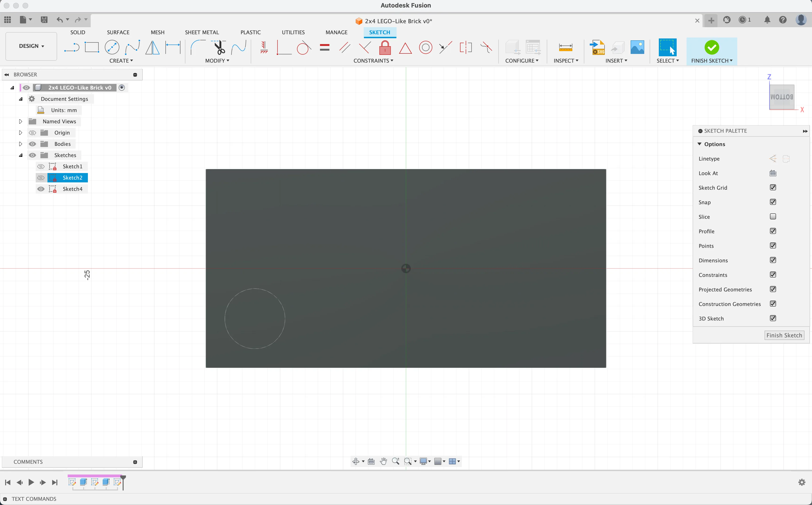
      <div class="click-highlight" aria-hidden="true"></div>
    </div>
  </div>
</div>
```

## 5.4 Select Project Tool {.content}

```{=html}
<div class="top-bar">5. MAKE A BOTTOM STUD</div>
<div class="screenshot-row" style="
    --highlight-x:22.0%;
    --highlight-y:7.0%;
    --highlight-w:10.0%;
    --highlight-h:15.0%;">
  <div class="callout-box">
    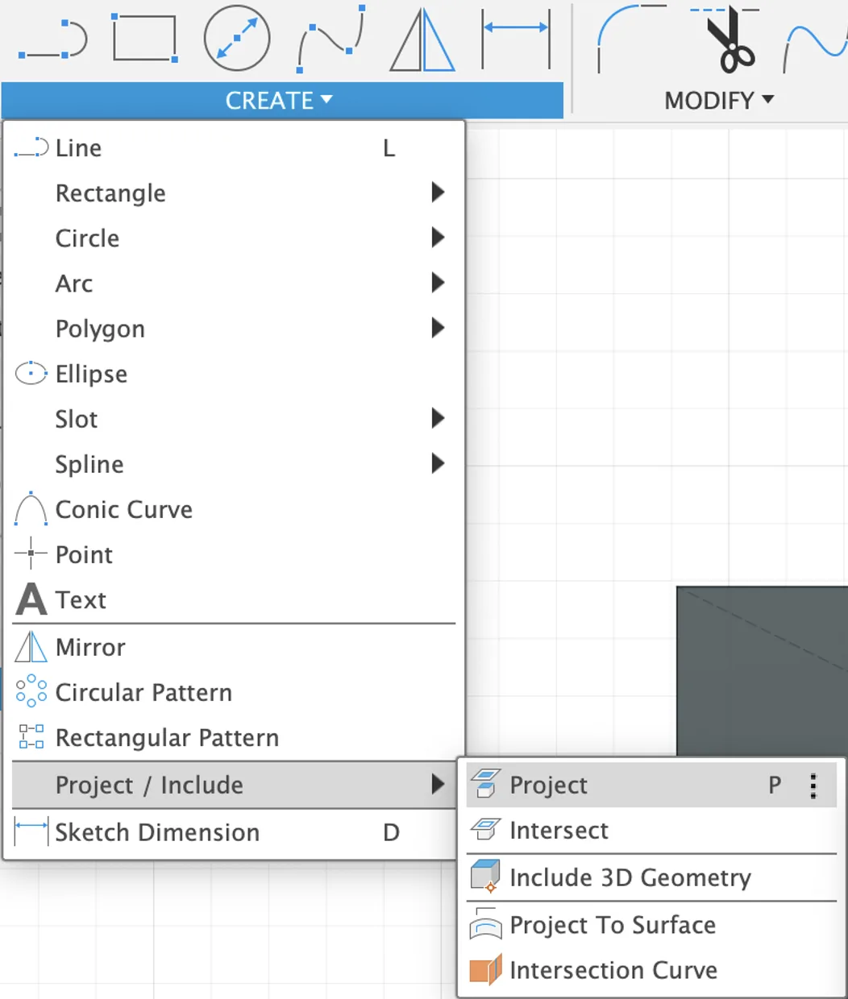
    <div class="callout-label">
      5.4.1: This is a common tool used to reference existing sketches or geometry 5. MAKE A BOTTOM STUD
    </div>
    <p class="concept-insight"><strong>*</strong> Keep dimensions parametric where possible.</p>
  </div>
  <div class="main-panel">
    <div class="main-shot-wrap">
      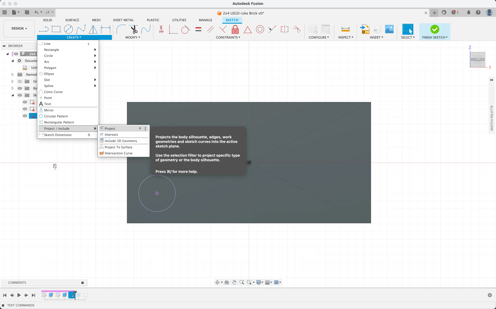
      <div class="click-highlight" aria-hidden="true"></div>
    </div>
  </div>
</div>
```

## 5.5 Project the Circle {.content}

```{=html}
<div class="top-bar">5. MAKE A BOTTOM STUD</div>
<div class="screenshot-row" style="
    --highlight-x:43.0%;
    --highlight-y:44.0%;
    --highlight-w:13.0%;
    --highlight-h:16.0%;">
  <div class="callout-box">
    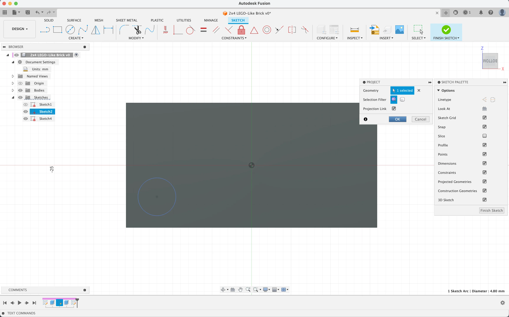
    <div class="callout-label">
      5.5.1: Click on the Circle and Select OK 5. MAKE A BOTTOM STUD
    </div>
    <p class="concept-insight"><strong>*</strong> Keep dimensions parametric where possible.</p>
  </div>
  <div class="main-panel">
    <div class="main-shot-wrap">
      
      <div class="click-highlight" aria-hidden="true"></div>
    </div>
  </div>
</div>
```

## 5.6 Select the Offset Tool {.content}

```{=html}
<div class="top-bar">5. MAKE A BOTTOM STUD</div>
<div class="screenshot-row" style="
    --highlight-x:25.0%;
    --highlight-y:7.0%;
    --highlight-w:9.0%;
    --highlight-h:15.0%;">
  <div class="callout-box">
    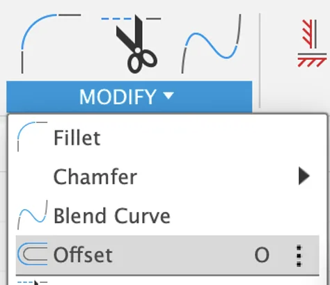
    <div class="callout-label">
      5.6.1: This is a common tool used to create a tolerance gap between two parts that fit together 5. MAKE A BOTTOM STUD
    </div>
    <p class="concept-insight"><strong>*</strong> Keep dimensions parametric where possible.</p>
  </div>
  <div class="main-panel">
    <div class="main-shot-wrap">
      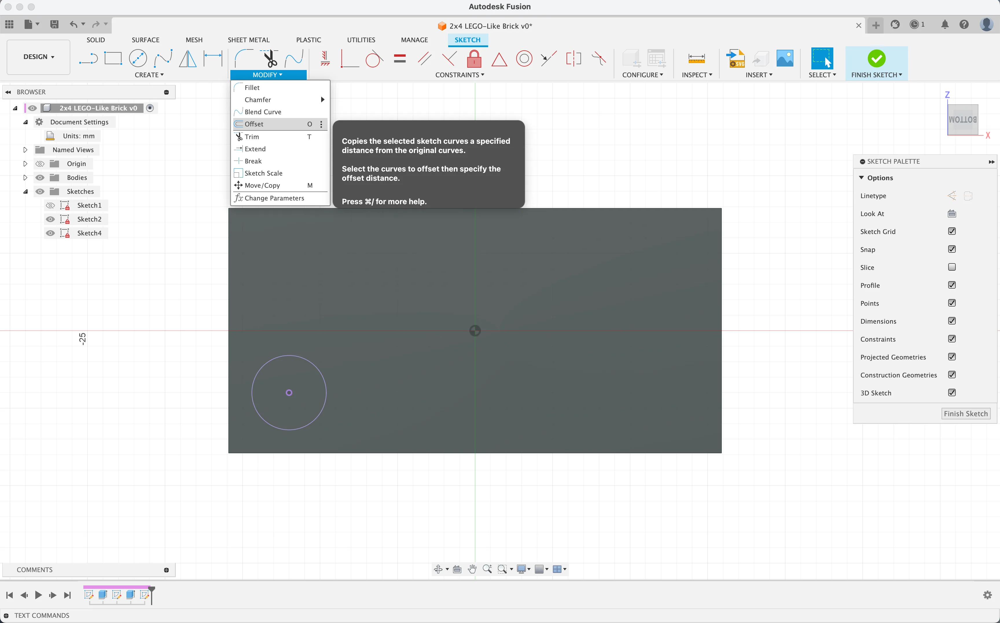
      <div class="click-highlight" aria-hidden="true"></div>
    </div>
  </div>
</div>
```

## 5.7 Offset the Circle {.content}

```{=html}
<div class="top-bar">5. MAKE A BOTTOM STUD</div>
<div class="screenshot-row" style="
    --highlight-x:81.0%;
    --highlight-y:24.0%;
    --highlight-w:16.0%;
    --highlight-h:19.0%;">
  <div class="callout-box">
    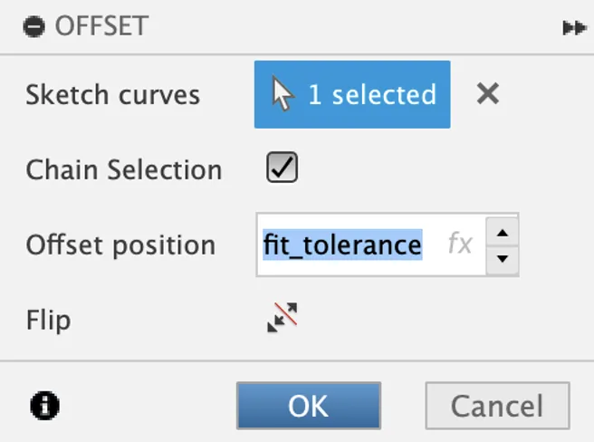
    <div class="callout-label">
      5.7.1: Click the circle and set the offset position to “ fit_tolerance ” This 0.1mm gap allows the top studs to snugly fit into the bottom studs. Without this gap the edges of the top and bottom studs would be exactly the same and collide with each other 5. MAKE A BOTTOM STUD
    </div>
    <p class="concept-insight"><strong>*</strong> Keep dimensions parametric where possible.</p>
  </div>
  <div class="main-panel">
    <div class="main-shot-wrap">
      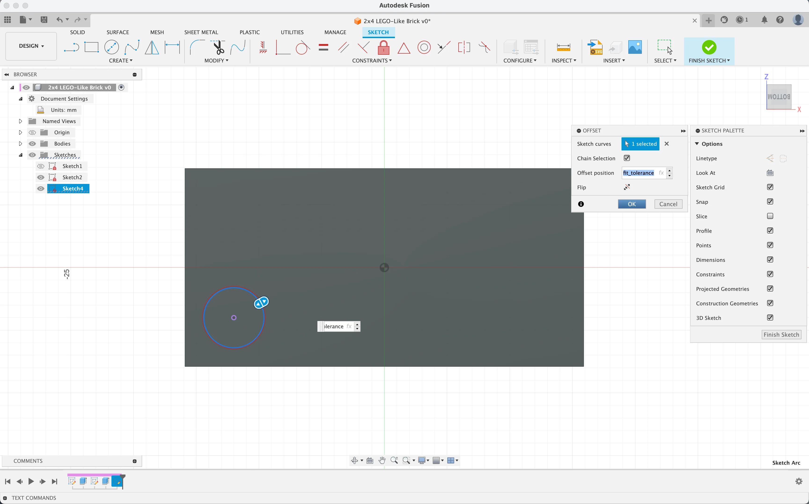
      <div class="click-highlight" aria-hidden="true"></div>
    </div>
  </div>
</div>
```

## 5.8 Finish the Sketch {.content}

```{=html}
<div class="top-bar">5. MAKE A BOTTOM STUD</div>
<div class="screenshot-row" style="
    --highlight-x:85.0%;
    --highlight-y:2.2%;
    --highlight-w:13.0%;
    --highlight-h:7.0%;">
  <div class="callout-box">
    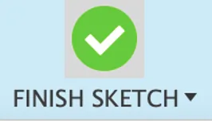
    <div class="callout-label">
      5.8.1: 5. MAKE A BOTTOM STUD
    </div>
    <p class="concept-insight"><strong>*</strong> Keep dimensions parametric where possible.</p>
  </div>
  <div class="main-panel">
    <div class="main-shot-wrap">
      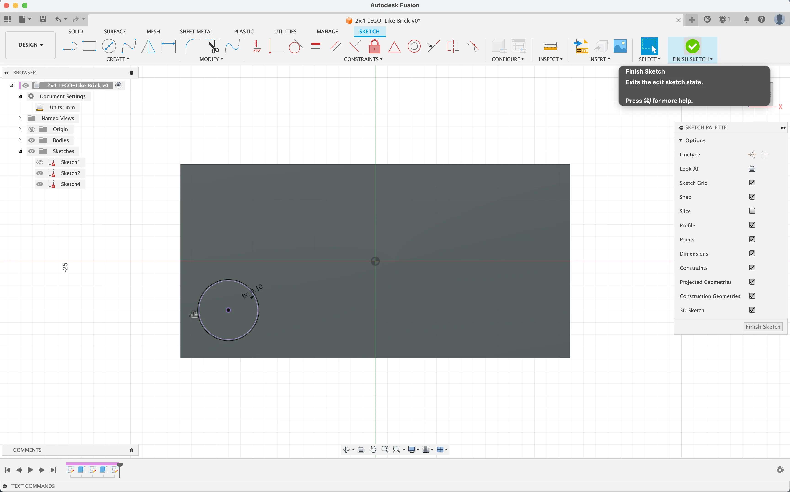
      <div class="click-highlight" aria-hidden="true"></div>
    </div>
  </div>
</div>
```

## 5.9 Extrude the {.content}

```{=html}
<div class="top-bar">5. MAKE A BOTTOM STUD</div>
<div class="screenshot-row" style="
    --highlight-x:42.0%;
    --highlight-y:44.0%;
    --highlight-w:14.0%;
    --highlight-h:18.0%;">
  <div class="callout-box">
    
    <div class="callout-label">
      5.9.1: Outer Circle Select the Extrude Tool Select the Outer and inner circle 5. MAKE A BOTTOM STUD
    </div>
    <p class="concept-insight"><strong>*</strong> Keep dimensions parametric where possible.</p>
  </div>
  <div class="main-panel">
    <div class="main-shot-wrap">
      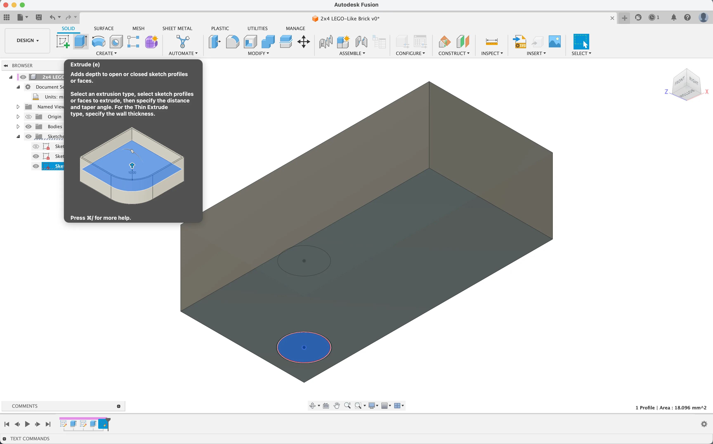
      <div class="click-highlight" aria-hidden="true"></div>
    </div>
  </div>
</div>
```

## 5.10 Set operation to “Cut” {.content}

```{=html}
<div class="top-bar">5. MAKE A BOTTOM STUD</div>
<div class="screenshot-row" style="
    --highlight-x:82.0%;
    --highlight-y:24.0%;
    --highlight-w:16.0%;
    --highlight-h:20.0%;">
  <div class="callout-box">
    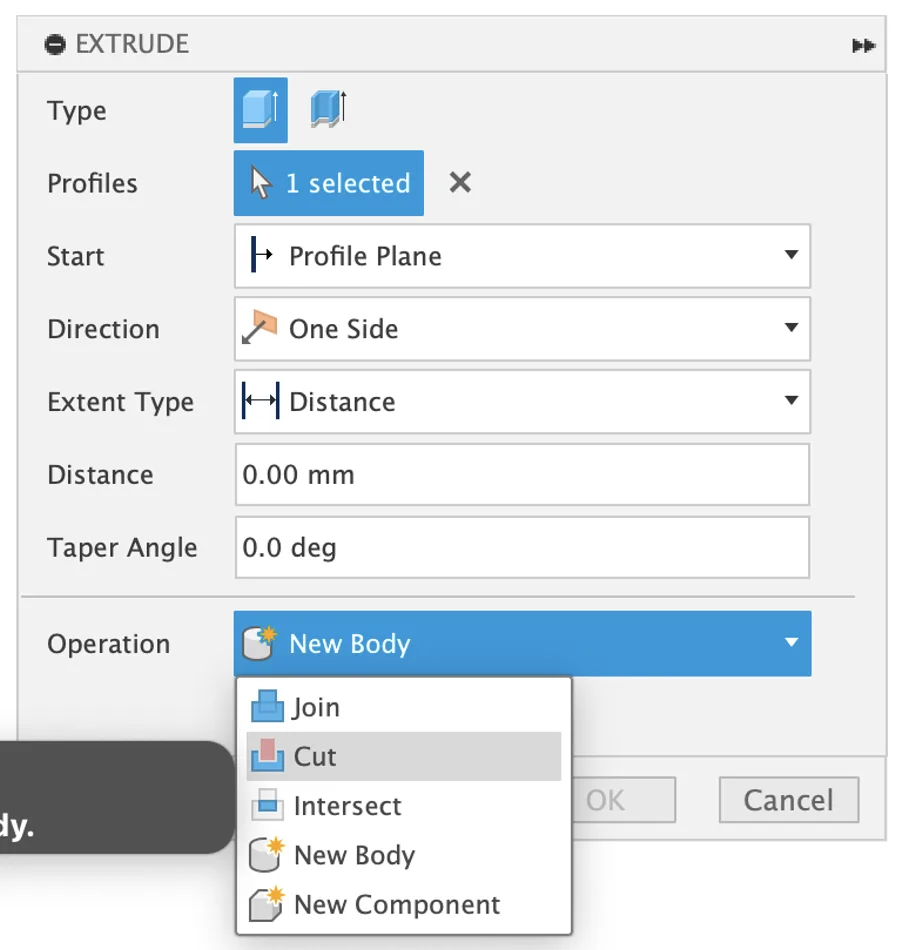
    <div class="callout-label">
      5.10.1: Change the extrude operation to “cut” 5. MAKE A BOTTOM STUD
    </div>
    <p class="concept-insight"><strong>*</strong> Keep dimensions parametric where possible.</p>
  </div>
  <div class="main-panel">
    <div class="main-shot-wrap">
      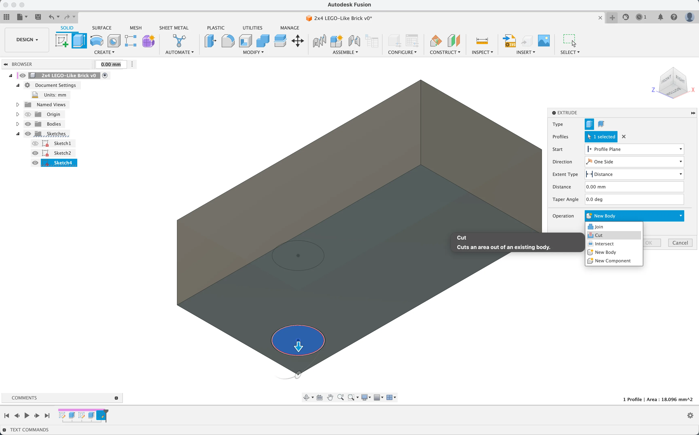
      <div class="click-highlight" aria-hidden="true"></div>
    </div>
  </div>
</div>
```

## 5.11 Set Cut Distance {.content}

```{=html}
<div class="top-bar">5. MAKE A BOTTOM STUD</div>
<div class="screenshot-row" style="
    --highlight-x:82.0%;
    --highlight-y:40.0%;
    --highlight-w:16.0%;
    --highlight-h:20.0%;">
  <div class="callout-box">
    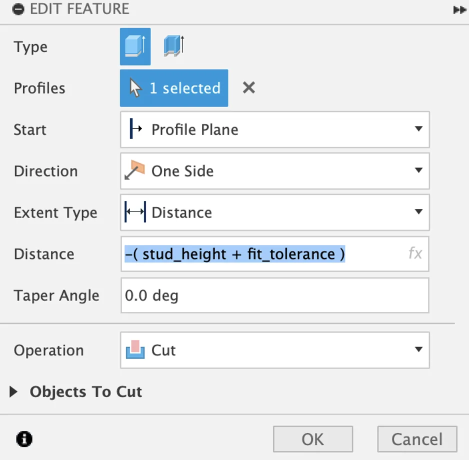
    <div class="callout-label">
      5.11.1: Set distance to: ”- ( stud_height + fit_tolerance )” “-” to change the direction of the cut “ stud_height ” to set depth of cut “ fit_tolerance ” adds extra gap for fit 5. MAKE A BOTTOM STUD
    </div>
    <p class="concept-insight"><strong>*</strong> Keep dimensions parametric where possible.</p>
  </div>
  <div class="main-panel">
    <div class="main-shot-wrap">
      
      <div class="click-highlight" aria-hidden="true"></div>
    </div>
  </div>
</div>
```

# 6.0.0 Make The Stud Pattern {.divider}

```{=html}
<div class="left-panel">
  <div class="number">6</div>
  <div class="label">MAKE THE STUD PATTERN</div>
</div>
<div class="right-panel">
  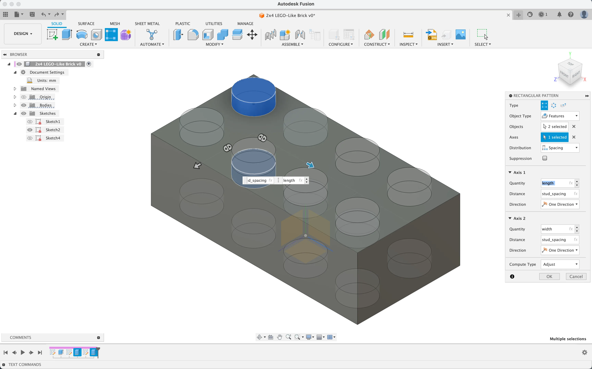
</div>
```

## 6.1 Click Rectangular Pattern {.content}

```{=html}
<div class="top-bar">6. MAKE THE STUD PATTERN</div>
<div class="screenshot-row" style="
    --highlight-x:12.0%;
    --highlight-y:7.0%;
    --highlight-w:12.0%;
    --highlight-h:10.0%;">
  <div class="callout-box">
    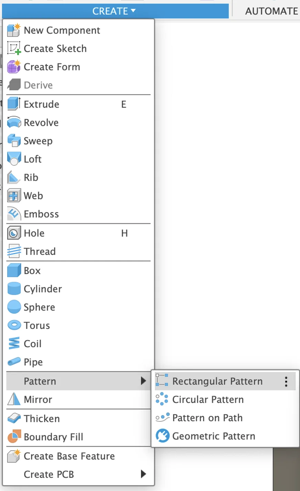
    <div class="callout-label">
      6.1.1: Click the Rectangular Pattern tool This is a common tool used to create repeated patterns like the studs 6. MAKE THE STUD PATTERN
    </div>
    <p class="concept-insight"><strong>*</strong> Keep dimensions parametric where possible.</p>
  </div>
  <div class="main-panel">
    <div class="main-shot-wrap">
      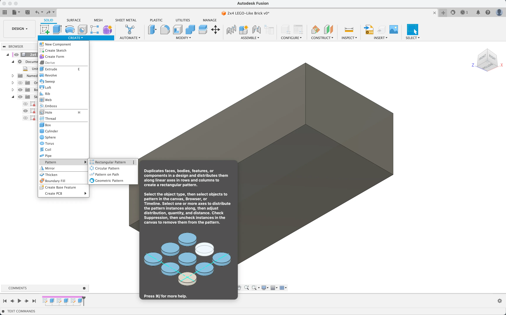
      <div class="click-highlight" aria-hidden="true"></div>
    </div>
  </div>
</div>
```

## 6.2 Change Object Type {.content}

```{=html}
<div class="top-bar">6. MAKE THE STUD PATTERN</div>
<div class="screenshot-row" style="
    --highlight-x:84.0%;
    --highlight-y:24.0%;
    --highlight-w:15.0%;
    --highlight-h:19.0%;">
  <div class="callout-box">
    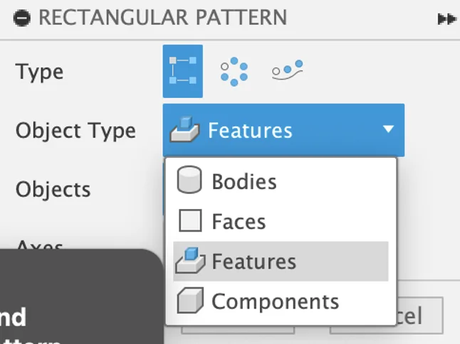
    <div class="callout-label">
      6.2.1: Change object type to “Features” 6. MAKE THE STUD PATTERN
    </div>
    <p class="concept-insight"><strong>*</strong> Keep dimensions parametric where possible.</p>
  </div>
  <div class="main-panel">
    <div class="main-shot-wrap">
      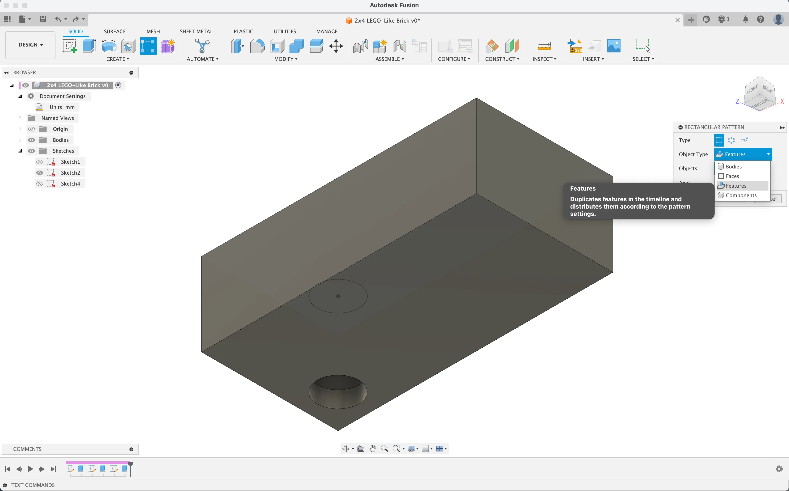
      <div class="click-highlight" aria-hidden="true"></div>
    </div>
  </div>
</div>
```

## 6.3 Select the Bottom Stud {.content}

```{=html}
<div class="top-bar">6. MAKE THE STUD PATTERN</div>
<div class="screenshot-row" style="
    --highlight-x:15.0%;
    --highlight-y:72.0%;
    --highlight-w:30.0%;
    --highlight-h:24.0%;">
  <div class="callout-box">
    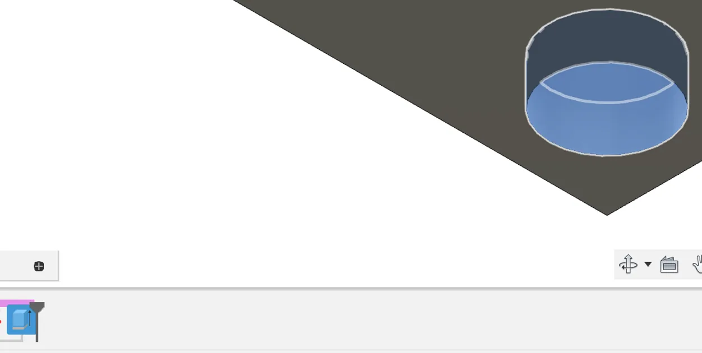
    <div class="callout-label">
      6.3.1: You can select it through the timeline or the feature itself 6. MAKE THE STUD PATTERN
    </div>
    <p class="concept-insight"><strong>*</strong> Keep dimensions parametric where possible.</p>
  </div>
  <div class="main-panel">
    <div class="main-shot-wrap">
      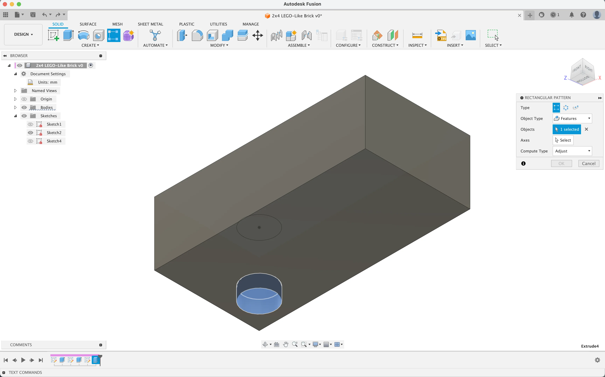
      <div class="click-highlight" aria-hidden="true"></div>
    </div>
  </div>
</div>
```

## 6.4 Select the Top Stud {.content}

```{=html}
<div class="top-bar">6. MAKE THE STUD PATTERN</div>
<div class="screenshot-row" style="
    --highlight-x:90.0%;
    --highlight-y:15.0%;
    --highlight-w:9.0%;
    --highlight-h:9.0%;">
  <div class="callout-box">
    
    <div class="callout-label">
      6.4.1: 6. MAKE THE STUD PATTERN
    </div>
    <p class="concept-insight"><strong>*</strong> Keep dimensions parametric where possible.</p>
  </div>
  <div class="main-panel">
    <div class="main-shot-wrap">
      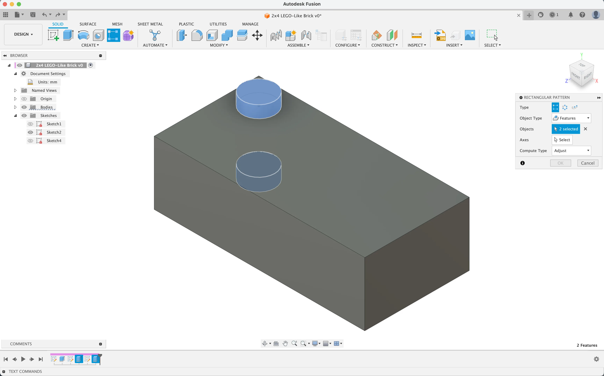
      <div class="click-highlight" aria-hidden="true"></div>
    </div>
  </div>
</div>
```

## 6.5 Select Axes {.content}

```{=html}
<div class="top-bar">6. MAKE THE STUD PATTERN</div>
<div class="screenshot-row" style="
    --highlight-x:85.0%;
    --highlight-y:24.0%;
    --highlight-w:14.0%;
    --highlight-h:21.0%;">
  <div class="callout-box">
    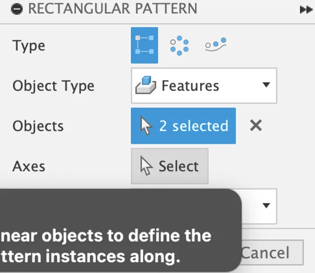
    <div class="callout-label">
      6.5.1: Click on the axes selection button in the rectangular pattern tab 6. MAKE THE STUD PATTERN
    </div>
    <p class="concept-insight"><strong>*</strong> Keep dimensions parametric where possible.</p>
  </div>
  <div class="main-panel">
    <div class="main-shot-wrap">
      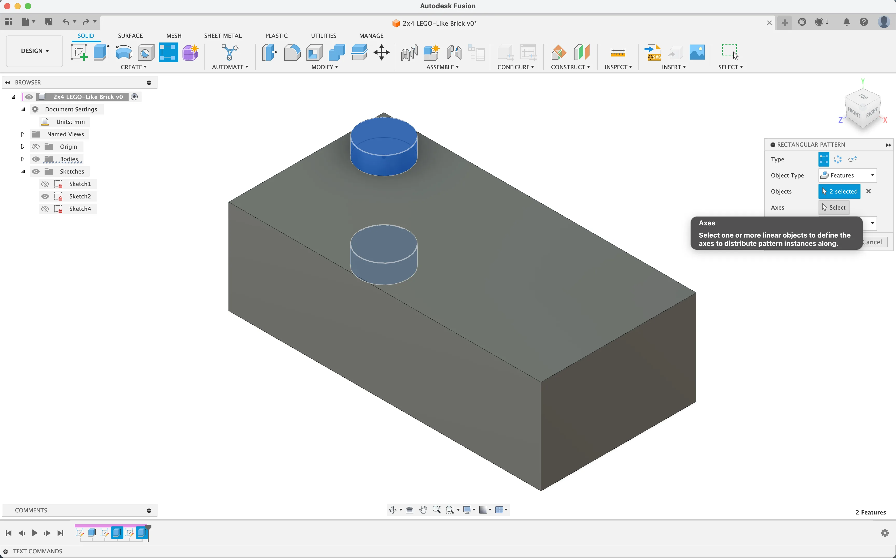
      <div class="click-highlight" aria-hidden="true"></div>
    </div>
  </div>
</div>
```

## 6.6 Click the Axis {.content}

```{=html}
<div class="top-bar">6. MAKE THE STUD PATTERN</div>
<div class="screenshot-row" style="
    --highlight-x:46.0%;
    --highlight-y:54.0%;
    --highlight-w:11.0%;
    --highlight-h:18.0%;">
  <div class="callout-box">
    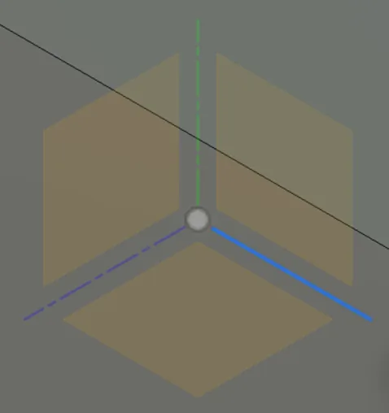
    <div class="callout-label">
      6.6.1: 6. MAKE THE STUD PATTERN
    </div>
    <p class="concept-insight"><strong>*</strong> Keep dimensions parametric where possible.</p>
  </div>
  <div class="main-panel">
    <div class="main-shot-wrap">
      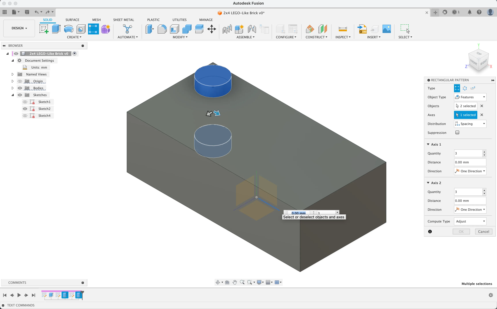
      <div class="click-highlight" aria-hidden="true"></div>
    </div>
  </div>
</div>
```

## 6.7 Set Distribution Type {.content}

```{=html}
<div class="top-bar">6. MAKE THE STUD PATTERN</div>
<div class="screenshot-row" style="
    --highlight-x:84.0%;
    --highlight-y:23.0%;
    --highlight-w:15.0%;
    --highlight-h:18.0%;">
  <div class="callout-box">
    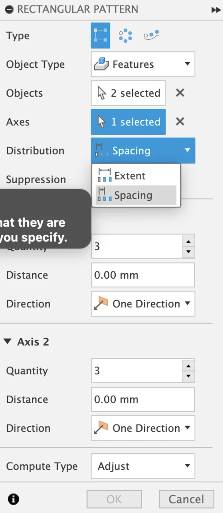
    <div class="callout-label">
      6.7.1: Set Distribution to “Spacing” This allows us to set the distance between each individual stud 6. MAKE THE STUD PATTERN
    </div>
    <p class="concept-insight"><strong>*</strong> Keep dimensions parametric where possible.</p>
  </div>
  <div class="main-panel">
    <div class="main-shot-wrap">
      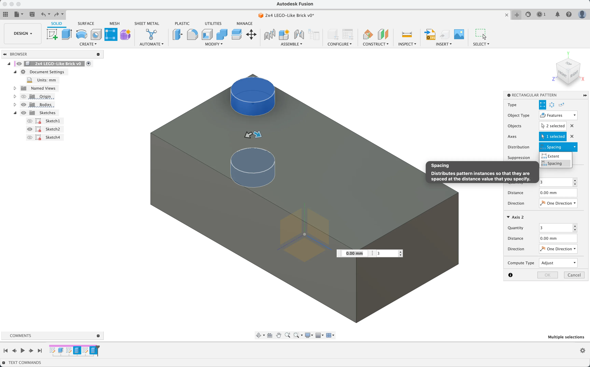
      <div class="click-highlight" aria-hidden="true"></div>
    </div>
  </div>
</div>
```

## 6.8 Set Axes Parameters {.content}

```{=html}
<div class="top-bar">6. MAKE THE STUD PATTERN</div>
<div class="screenshot-row" style="
    --highlight-x:84.0%;
    --highlight-y:29.0%;
    --highlight-w:15.0%;
    --highlight-h:34.0%;">
  <div class="callout-box">
    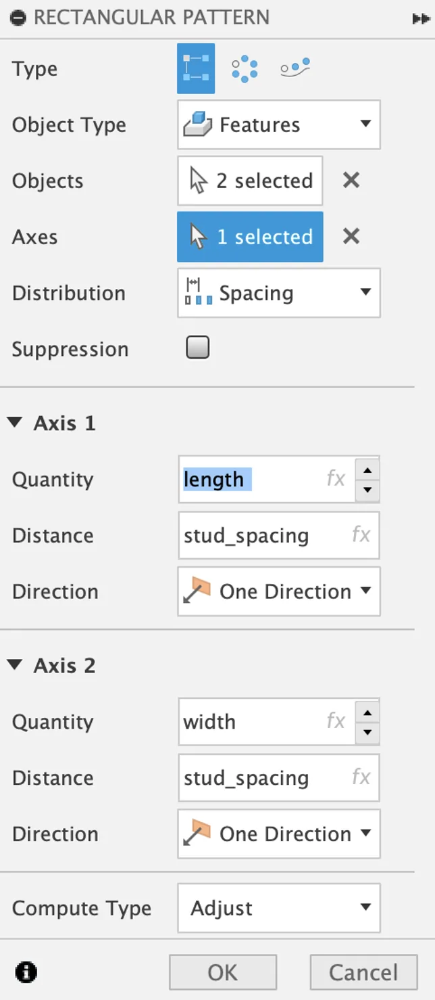
    <div class="callout-label">
      6.8.1: Set Axis 1 Quantity to <strong>“length”</strong> and distance to <strong>“ stud_spacing ”</strong> Set Axis 2 Quantity to <strong>“width”</st and distance to “ stud_spacing ” 6. MAKE THE STUD PATTERN
    </div>
    <p class="concept-insight"><strong>*</strong> Keep dimensions parametric where possible.</p>
  </div>
  <div class="main-panel">
    <div class="main-shot-wrap">
      
      <div class="click-highlight" aria-hidden="true"></div>
    </div>
  </div>
</div>
```

## 6.9 We’re Finished! {.content}

```{=html}
<div class="top-bar">6. MAKE THE STUD PATTERN</div>
<div class="screenshot-row" style="
    --highlight-x:78.0%;
    --highlight-y:6.0%;
    --highlight-w:6.5%;
    --highlight-h:6.5%;">
  <div class="callout-box">
    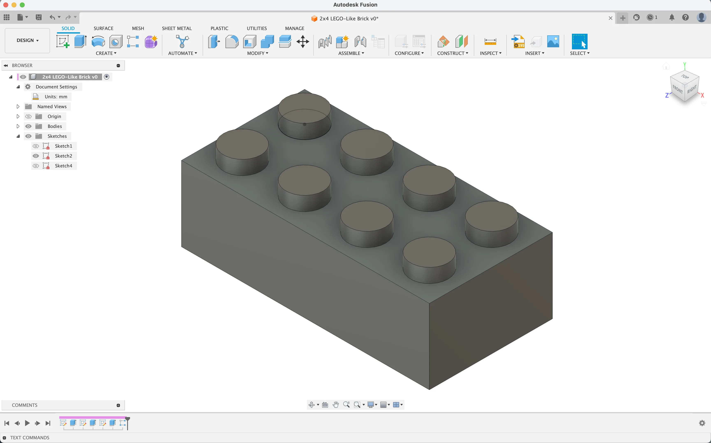
    <div class="callout-label">
      6.9.1: 6. MAKE THE STUD PATTERN
    </div>
    <p class="concept-insight"><strong>*</strong> Keep dimensions parametric where possible.</p>
  </div>
  <div class="main-panel">
    <div class="main-shot-wrap">
      
      <div class="click-highlight" aria-hidden="true"></div>
    </div>
  </div>
</div>
```
