# 0.0.0 Overview {.divider}

```{=html}
<div class="left-panel">
  <div class="number">0</div>
  <div class="label">OVERVIEW</div>
</div>
<div class="right-panel">
  
</div>
```

## 0.1 COLLECT ALL MATERIALS {.content}

```{=html}
<div class="top-bar">0. OVERVIEW</div>
<div class="screenshot-row">
  <div class="callout-box">
    <div class="callout-label">
      0.1: Collect all the materials.
    </div>
    <p class="concept-insight"><strong>*</strong> Add the reason behind this step.</p>
  </div>
  <div class="main-panel">
    <div class="main-shot-wrap">
      
    </div>
  </div>
</div>
```

# 1.0.0 Thread the Machine {.divider}

```{=html}
<div class="left-panel">
  <div class="number">1</div>
  <div class="label">THREAD THE MACHINE</div>
</div>
<div class="right-panel">
  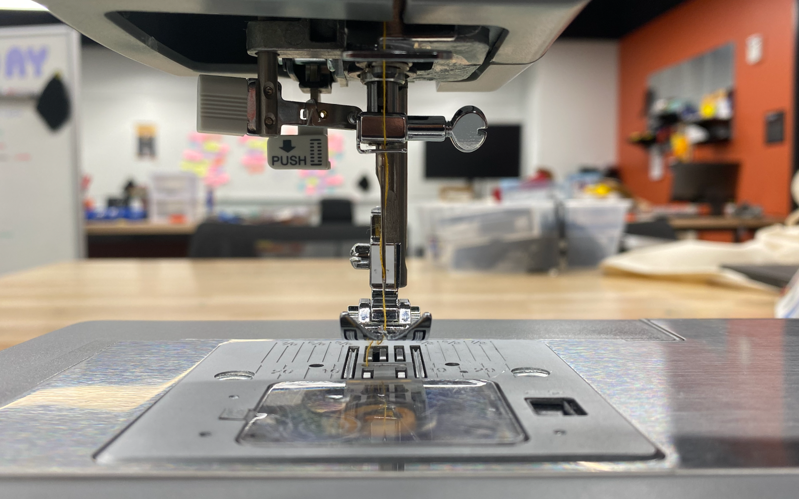
</div>
```

## 1.1 REMOVE BOBBIN COVER {.content}

```{=html}
<div class="top-bar">1. THREAD THE MACHINE</div>
<div class="screenshot-row">
  <div class="callout-box">
    <div class="callout-label">
      1.1: Slide off the bobbin cover to access the bobbin area.
    </div>
    <p class="concept-insight"><strong>*</strong> Add the reason behind this step.</p>
  </div>
  <div class="main-panel">
    <div class="main-shot-wrap">
      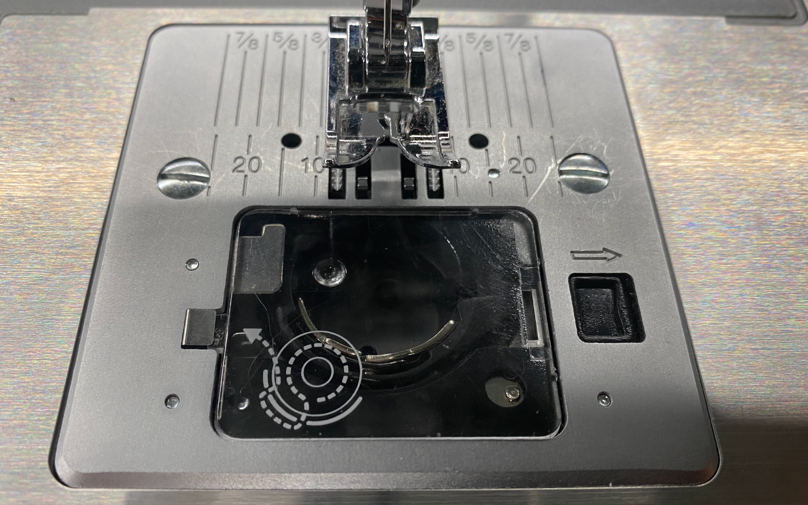
    </div>
  </div>
</div>
```

## 1.2 THREAD THE BOBBIN {.content}

```{=html}
<div class="top-bar">1. THREAD THE MACHINE</div>
<div class="screenshot-row">
  <div class="callout-box">
    <div class="callout-label">
      1.2: Insert and thread the bobbin following the machine's guide arrows.
    </div>
    <p class="concept-insight"><strong>*</strong> Add the reason behind this step.</p>
  </div>
  <div class="main-panel">
    <div class="main-shot-wrap">
      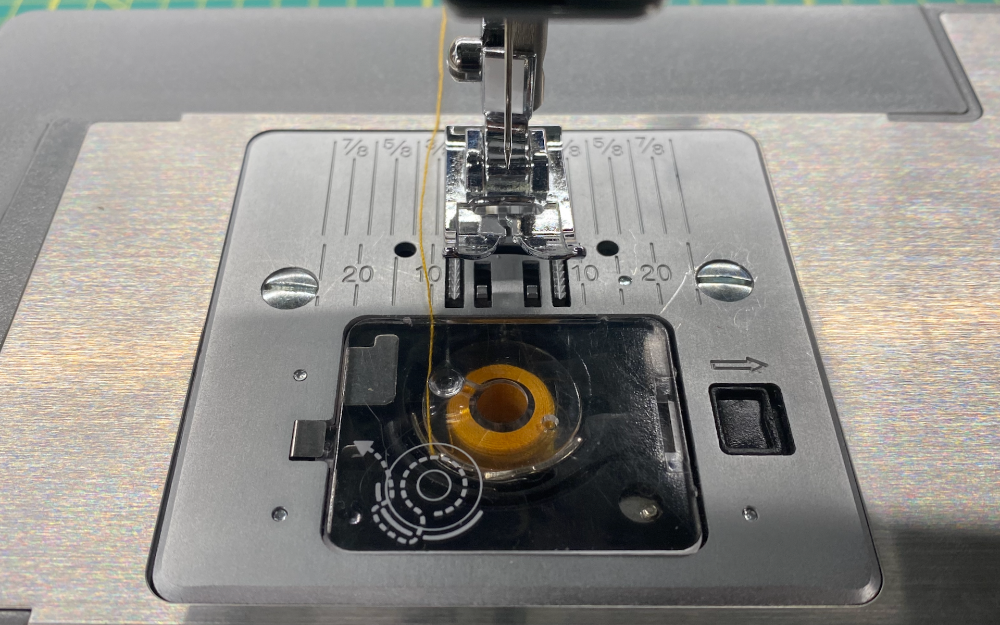
    </div>
  </div>
</div>
```

## 1.3 INSERT THREAD SPOOL {.content}

```{=html}
<div class="top-bar">1. THREAD THE MACHINE</div>
<div class="screenshot-row">
  <div class="callout-box">
    <div class="callout-label">
      1.3: Place the thread spool onto the spool pin.
    </div>
    <p class="concept-insight"><strong>*</strong> Add the reason behind this step.</p>
  </div>
  <div class="main-panel">
    <div class="main-shot-wrap">
      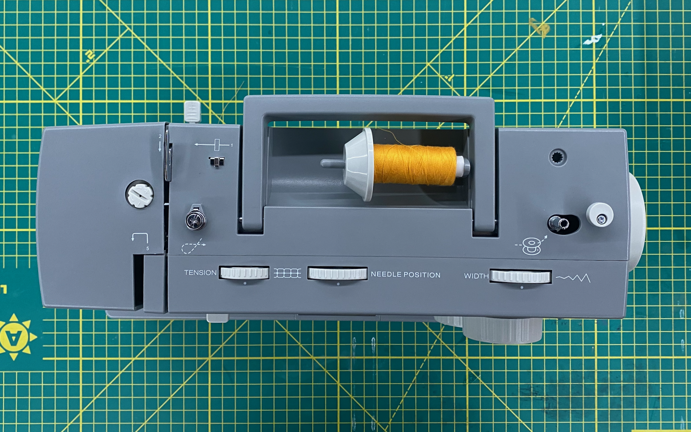
    </div>
  </div>
</div>
```

## 1.4 THREAD TOP THREAD (PART 1) {.content}

```{=html}
<div class="top-bar">1. THREAD THE MACHINE</div>
<div class="screenshot-row">
  <div class="callout-box">
    <div class="callout-label">
      1.4: Guide the thread from the spool through the upper tension guides.
    </div>
    <p class="concept-insight"><strong>*</strong> Add the reason behind this step.</p>
  </div>
  <div class="main-panel">
    <div class="main-shot-wrap">
      
    </div>
  </div>
</div>
```

## 1.5 THREAD TOP THREAD (PART 2) {.content}

```{=html}
<div class="top-bar">1. THREAD THE MACHINE</div>
<div class="screenshot-row">
  <div class="callout-box">
    <div class="callout-label">
      1.5: Continue threading through the take-up lever and down through the needle.
    </div>
    <p class="concept-insight"><strong>*</strong> Add the reason behind this step.</p>
  </div>
  <div class="main-panel">
    <div class="main-shot-wrap">
      
    </div>
  </div>
</div>
```

## 1.6 LOCATE THE PLUG {.content}

```{=html}
<div class="top-bar">1. THREAD THE MACHINE</div>
<div class="screenshot-row">
  <div class="callout-box">
    <div class="callout-label">
      1.6: Locate the power plug on the back of the machine.
    </div>
    <p class="concept-insight"><strong>*</strong> Add the reason behind this step.</p>
  </div>
  <div class="main-panel">
    <div class="main-shot-wrap">
      
    </div>
  </div>
</div>
```

## 1.7 PLUG PEDAL INTO MACHINE {.content}

```{=html}
<div class="top-bar">1. THREAD THE MACHINE</div>
<div class="screenshot-row">
  <div class="callout-box">
    <div class="callout-label">
      1.7: Connect the foot pedal cable into the machine.
    </div>
    <p class="concept-insight"><strong>*</strong> Add the reason behind this step.</p>
  </div>
  <div class="main-panel">
    <div class="main-shot-wrap">
      
    </div>
  </div>
</div>
```

## 1.8 TURN ON THE MACHINE {.content}

```{=html}
<div class="top-bar">1. THREAD THE MACHINE</div>
<div class="screenshot-row">
  <div class="callout-box">
    <div class="callout-label">
      1.8: Flip the power switch to turn the machine on.
    </div>
    <p class="concept-insight"><strong>*</strong> Add the reason behind this step.</p>
  </div>
  <div class="main-panel">
    <div class="main-shot-wrap">
      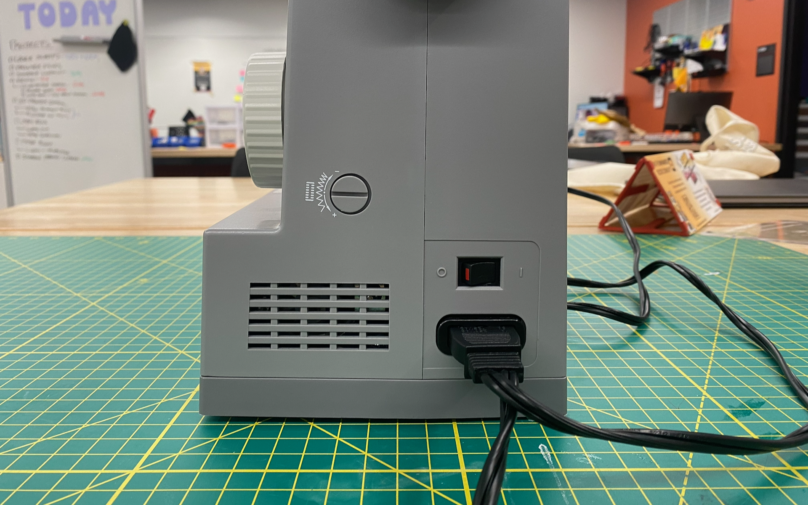
    </div>
  </div>
</div>
```

# 2.0.0 Prep Your Fabric {.divider}

```{=html}
<div class="left-panel">
  <div class="number">2</div>
  <div class="label">PREP YOUR FABRIC</div>
</div>
<div class="right-panel">
  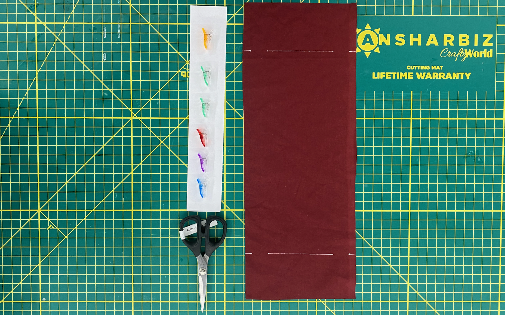
</div>
```

## 2.1 PREP THE FABRIC {.content}

```{=html}
<div class="top-bar">2. PREP YOUR FABRIC</div>
<div class="screenshot-row">
  <div class="callout-box">
    <div class="callout-label">
      2.1: Lay the fabric flat and smooth out any wrinkles before cutting.
    </div>
    <p class="concept-insight"><strong>*</strong> Add the reason behind this step.</p>
  </div>
  <div class="main-panel">
    <div class="main-shot-wrap">
      
    </div>
  </div>
</div>
```

## 2.2 MAKE A SMALL CUT AT MARK {.content}

```{=html}
<div class="top-bar">2. PREP YOUR FABRIC</div>
<div class="screenshot-row">
  <div class="callout-box">
    <div class="callout-label">
      2.2: Make a small notch cut at the marked position on the fabric edge.
    </div>
    <p class="concept-insight"><strong>*</strong> Add the reason behind this step.</p>
  </div>
  <div class="main-panel">
    <div class="main-shot-wrap">
      
    </div>
  </div>
</div>
```

## 2.3 MAKE REMAINING SMALL CUTS {.content}

```{=html}
<div class="top-bar">2. PREP YOUR FABRIC</div>
<div class="screenshot-row">
  <div class="callout-box">
    <div class="callout-label">
      2.3: Repeat the notch cuts at all remaining marked positions.
    </div>
    <p class="concept-insight"><strong>*</strong> Add the reason behind this step.</p>
  </div>
  <div class="main-panel">
    <div class="main-shot-wrap">
      
    </div>
  </div>
</div>
```

## 2.4 FOLD FABRIC IN HALF AND CLIP {.content}

```{=html}
<div class="top-bar">2. PREP YOUR FABRIC</div>
<div class="screenshot-row">
  <div class="callout-box">
    <div class="callout-label">
      2.4: Fold the fabric in half with right sides together and clip the edges to hold.
    </div>
    <p class="concept-insight"><strong>*</strong> Add the reason behind this step.</p>
  </div>
  <div class="main-panel">
    <div class="main-shot-wrap">
      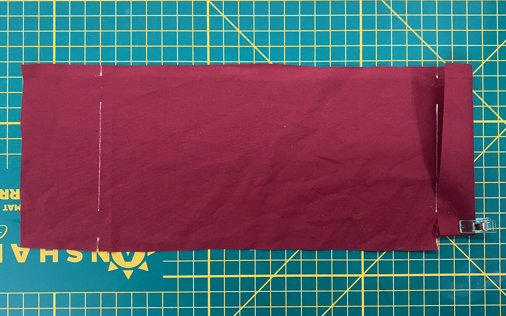
    </div>
  </div>
</div>
```

## 2.5 REPEAT ON REMAINING SIDE {.content}

```{=html}
<div class="top-bar">2. PREP YOUR FABRIC</div>
<div class="screenshot-row">
  <div class="callout-box">
    <div class="callout-label">
      2.5: Fold and clip the remaining side to complete the channel around the bag.
    </div>
    <p class="concept-insight"><strong>*</strong> Add the reason behind this step.</p>
  </div>
  <div class="main-panel">
    <div class="main-shot-wrap">
      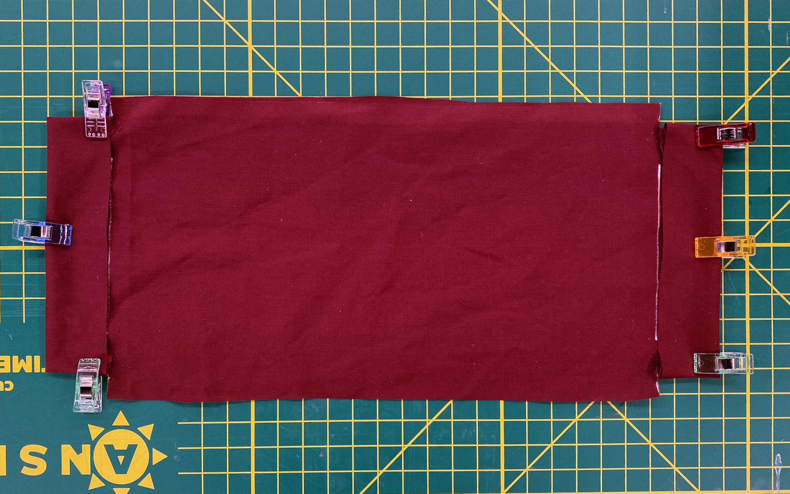
    </div>
  </div>
</div>
```

# 3.0.0 Sew {.divider}

```{=html}
<div class="left-panel">
  <div class="number">3</div>
  <div class="label">SEW</div>
</div>
<div class="right-panel">
  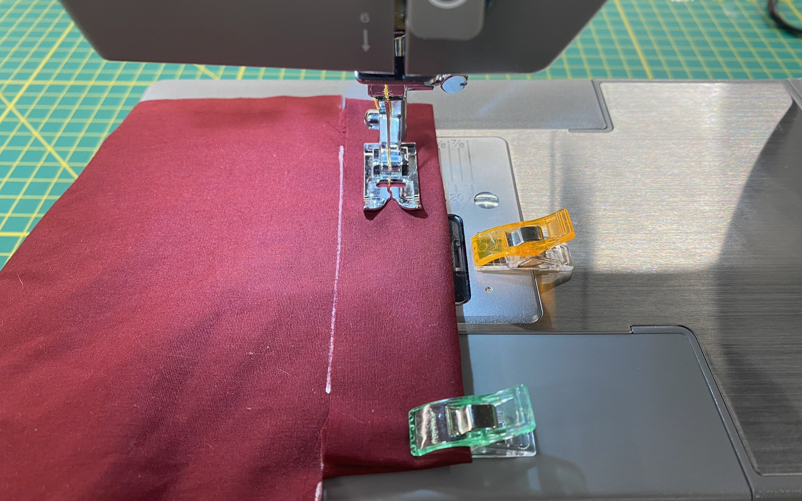
</div>
```

## 3.1 ALIGN FABRIC AT 5/8 IN (SEAM ALLOWANCE) {.content}

```{=html}
<div class="top-bar">3. SEW</div>
<div class="screenshot-row">
  <div class="callout-box">
    <div class="callout-label">
      3.1: Shift the fabric to align with the 5/8 in seam allowance guide.
    </div>
    <p class="concept-insight"><strong>*</strong> Add the reason behind this step.</p>
  </div>
  <div class="main-panel">
    <div class="main-shot-wrap">
      
    </div>
  </div>
</div>
```

## 3.2 SET MACHINE LENGTH AND STITCH SETTING {.content}

```{=html}
<div class="top-bar">3. SEW</div>
<div class="screenshot-row">
  <div class="callout-box">
    <div class="callout-label">
      3.2: Dial in the stitch length and stitch type before sewing.
    </div>
    <p class="concept-insight"><strong>*</strong> Add the reason behind this step.</p>
  </div>
  <div class="main-panel">
    <div class="main-shot-wrap">
      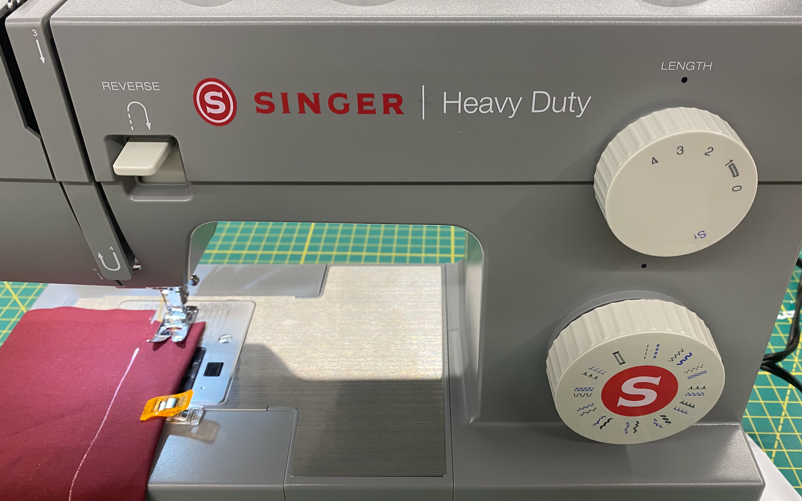
    </div>
  </div>
</div>
```

## 3.3 MAKE REVERSE STITCH {.content}

```{=html}
<div class="top-bar">3. SEW</div>
<div class="screenshot-row">
  <div class="callout-box">
    <div class="callout-label">
      3.3: Press the reverse button and backstitch a few stitches to lock the seam.
    </div>
    <p class="concept-insight"><strong>*</strong> Add the reason behind this step.</p>
  </div>
  <div class="main-panel">
    <div class="main-shot-wrap">
      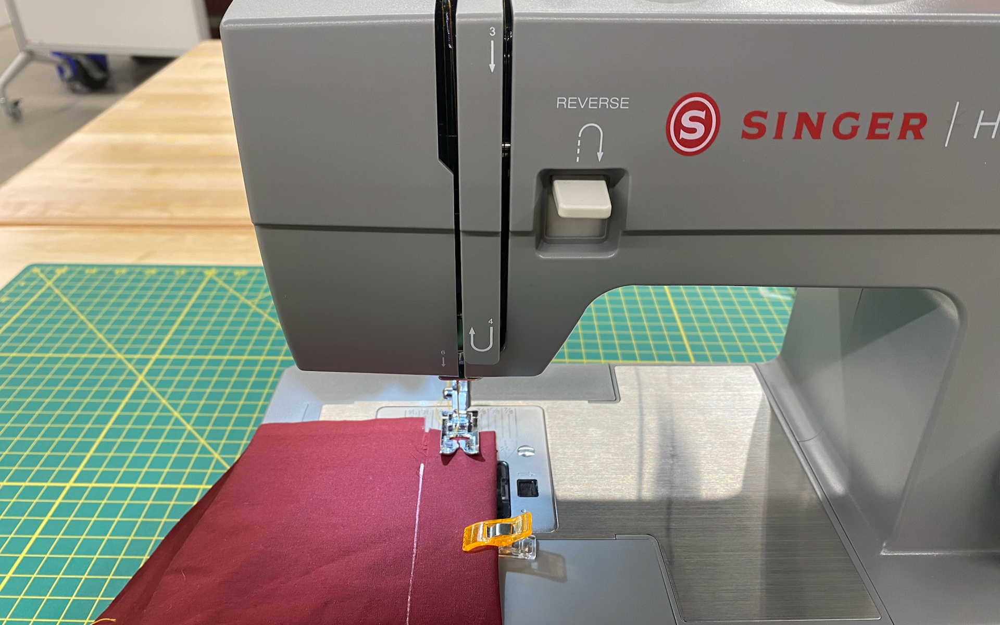
    </div>
  </div>
</div>
```

## 3.4 CONTINUE STRAIGHT STITCH {.content}

```{=html}
<div class="top-bar">3. SEW</div>
<div class="screenshot-row">
  <div class="callout-box">
    <div class="callout-label">
      3.4: Press the foot pedal and guide the fabric to sew a straight stitch along the edge.
    </div>
    <p class="concept-insight"><strong>*</strong> Add the reason behind this step.</p>
  </div>
  <div class="main-panel">
    <div class="main-shot-wrap">
      
    </div>
  </div>
</div>
```

## 3.5 CUT EXCESS THREAD {.content}

```{=html}
<div class="top-bar">3. SEW</div>
<div class="screenshot-row">
  <div class="callout-box">
    <div class="callout-label">
      3.5: Trim any loose threads from the seams and drawstring ends.
    </div>
    <p class="concept-insight"><strong>*</strong> Add the reason behind this step.</p>
  </div>
  <div class="main-panel">
    <div class="main-shot-wrap">
      
    </div>
  </div>
</div>
```

## 3.6 YOU HAVE A COMPLETED STRAIGHT STITCH! {.content}

```{=html}
<div class="top-bar">3. SEW</div>
<div class="screenshot-row">
  <div class="callout-box">
    <div class="callout-label">
      3.6: Great work — both seams are sewn and locked at both ends.
    </div>
    <p class="concept-insight"><strong>*</strong> Add the reason behind this step.</p>
  </div>
  <div class="main-panel">
    <div class="main-shot-wrap">
      
    </div>
  </div>
</div>
```

## 3.7 REPEAT STRAIGHT STITCH ON OPPOSITE SIDE {.content}

```{=html}
<div class="top-bar">3. SEW</div>
<div class="screenshot-row">
  <div class="callout-box">
    <div class="callout-label">
      3.7: Rotate the fabric and repeat the straight stitch along the opposite edge.
    </div>
    <p class="concept-insight"><strong>*</strong> Add the reason behind this step.</p>
  </div>
  <div class="main-panel">
    <div class="main-shot-wrap">
      
    </div>
  </div>
</div>
```

# 4.0.0 Sew the Bag {.divider}

```{=html}
<div class="left-panel">
  <div class="number">4</div>
  <div class="label">SEW THE BAG</div>
</div>
<div class="right-panel">
  
</div>
```

## 4.1 FOLD FABRIC AT CUT {.content}

```{=html}
<div class="top-bar">4. SEW THE BAG</div>
<div class="screenshot-row">
  <div class="callout-box">
    <div class="callout-label">
      4.1: Fold the top edge of the fabric down at the notch cut to create the drawstring channel.
    </div>
    <p class="concept-insight"><strong>*</strong> Add the reason behind this step.</p>
  </div>
  <div class="main-panel">
    <div class="main-shot-wrap">
      
    </div>
  </div>
</div>
```

## 4.2 ALIGN FABRIC AT 3/8 IN {.content}

```{=html}
<div class="top-bar">4. SEW THE BAG</div>
<div class="screenshot-row">
  <div class="callout-box">
    <div class="callout-label">
      4.2: Line up the fabric edge with the 3/8 in seam guide on the machine.
    </div>
    <p class="concept-insight"><strong>*</strong> Add the reason behind this step.</p>
  </div>
  <div class="main-panel">
    <div class="main-shot-wrap">
      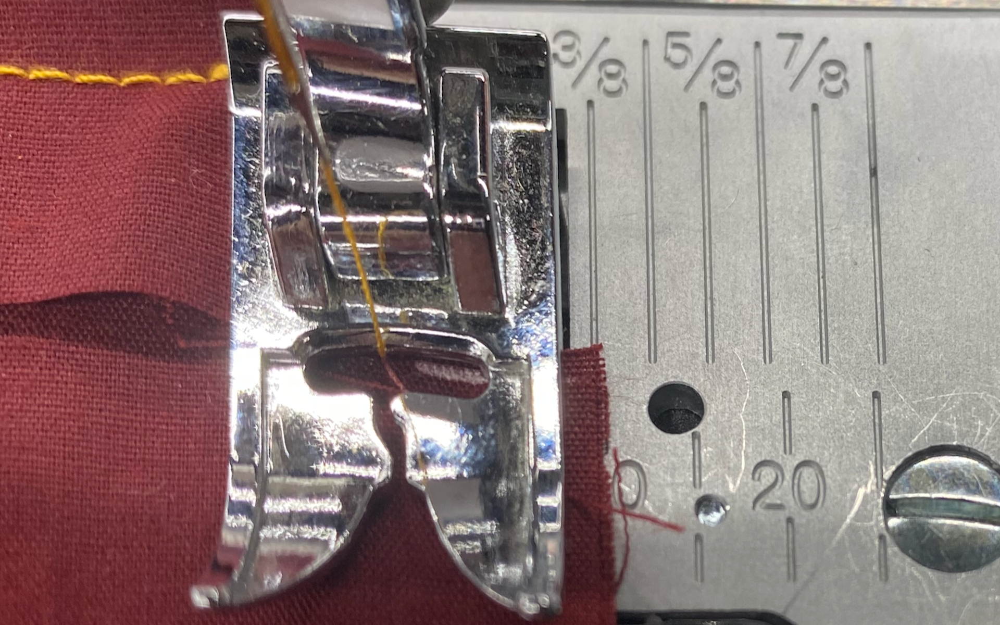
    </div>
  </div>
</div>
```

## 4.3 STRAIGHT STITCH BOTH SIDES {.content}

```{=html}
<div class="top-bar">4. SEW THE BAG</div>
<div class="screenshot-row">
  <div class="callout-box">
    <div class="callout-label">
      4.3: Both sides of the bag are now stitched — check that seams are even.
    </div>
    <p class="concept-insight"><strong>*</strong> Add the reason behind this step.</p>
  </div>
  <div class="main-panel">
    <div class="main-shot-wrap">
      
    </div>
  </div>
</div>
```

## 4.4 FLIP INSIDE OUT {.content}

```{=html}
<div class="top-bar">4. SEW THE BAG</div>
<div class="screenshot-row">
  <div class="callout-box">
    <div class="callout-label">
      4.4: Reach through the open top and pull the bag right-side out.
    </div>
    <p class="concept-insight"><strong>*</strong> Add the reason behind this step.</p>
  </div>
  <div class="main-panel">
    <div class="main-shot-wrap">
      
    </div>
  </div>
</div>
```

# 5.0.0 Finish the Bag {.divider}

```{=html}
<div class="left-panel">
  <div class="number">5</div>
  <div class="label">FINISH THE BAG</div>
</div>
<div class="right-panel">
  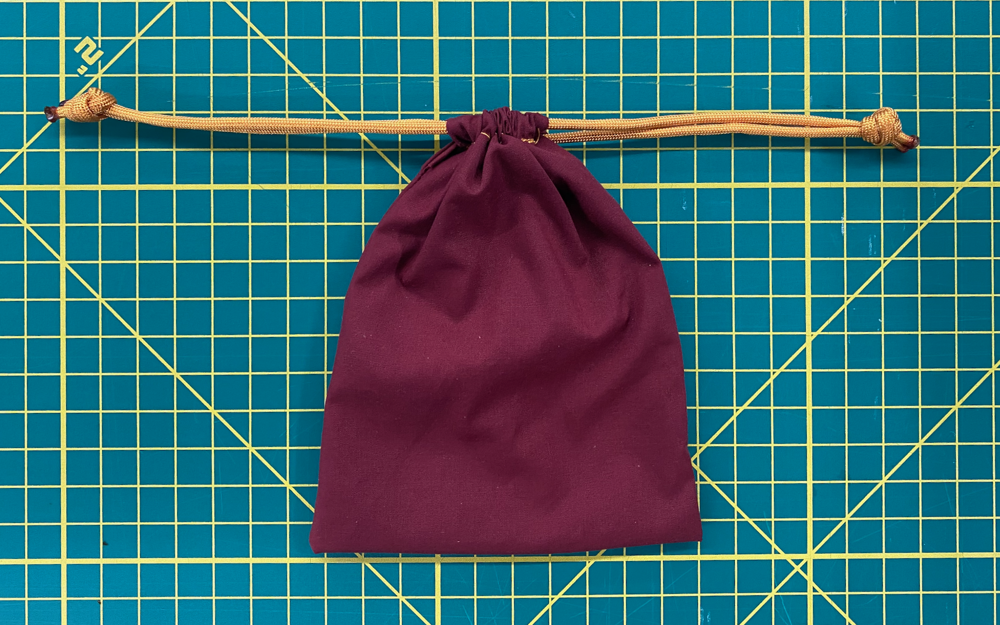
</div>
```

## 5.1 THREAD THE DRAWSTRING MATERIALS {.content}

```{=html}
<div class="top-bar">5. FINISH THE BAG</div>
<div class="screenshot-row">
  <div class="callout-box">
    <div class="callout-label">
      5.1: Gather the Materials
    </div>
    <p class="concept-insight"><strong>*</strong> Add the reason behind this step.</p>
  </div>
  <div class="main-panel">
    <div class="main-shot-wrap">
      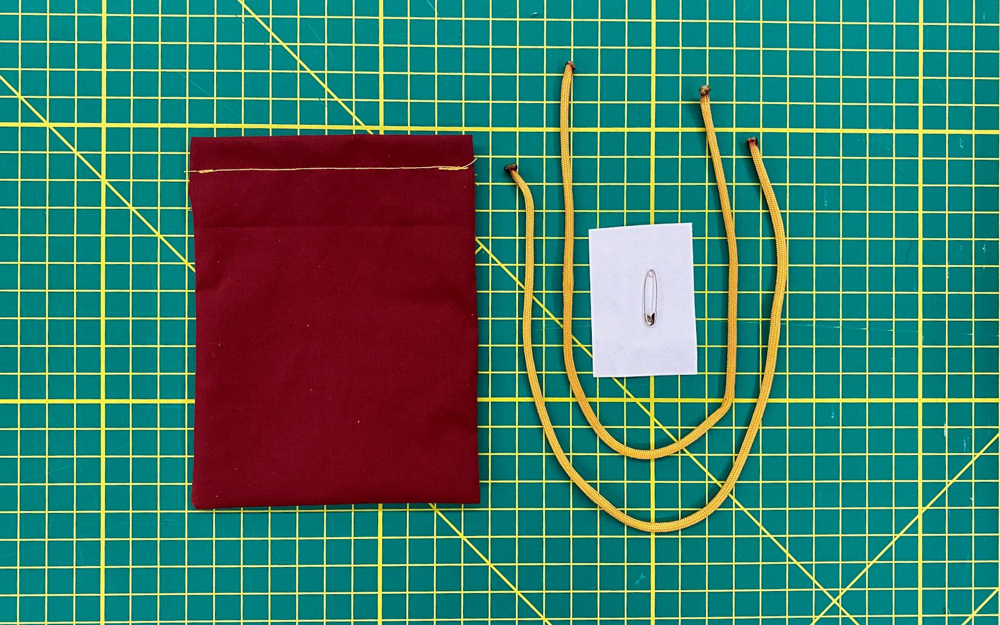
    </div>
  </div>
</div>
```

## 5.2 ATTACH SAFETY PIN TO STRING {.content}

```{=html}
<div class="top-bar">5. FINISH THE BAG</div>
<div class="screenshot-row">
  <div class="callout-box">
    <div class="callout-label">
      5.2: Clip a safety pin to the end of the drawstring to make threading easier.
    </div>
    <p class="concept-insight"><strong>*</strong> Add the reason behind this step.</p>
  </div>
  <div class="main-panel">
    <div class="main-shot-wrap">
      
    </div>
  </div>
</div>
```

## 5.3 THREAD STRING THROUGH ONE CHANNEL {.content}

```{=html}
<div class="top-bar">5. FINISH THE BAG</div>
<div class="screenshot-row">
  <div class="callout-box">
    <div class="callout-label">
      5.3: Use a safety pin to guide the drawstring through one side of the channel.
    </div>
    <p class="concept-insight"><strong>*</strong> Add the reason behind this step.</p>
  </div>
  <div class="main-panel">
    <div class="main-shot-wrap">
      
    </div>
  </div>
</div>
```

## 5.4 THREAD STRING THROUGH OTHER CHANNEL {.content}

```{=html}
<div class="top-bar">5. FINISH THE BAG</div>
<div class="screenshot-row">
  <div class="callout-box">
    <div class="callout-label">
      5.4: Feed the string back through the other channel so both ends exit from the same side.
    </div>
    <p class="concept-insight"><strong>*</strong> Add the reason behind this step.</p>
  </div>
  <div class="main-panel">
    <div class="main-shot-wrap">
      
    </div>
  </div>
</div>
```

## 5.5 THREAD OTHER STRING FROM OPPOSITE SIDE {.content}

```{=html}
<div class="top-bar">5. FINISH THE BAG</div>
<div class="screenshot-row">
  <div class="callout-box">
    <div class="callout-label">
      5.5: Thread the second string from the opposite side through both channels.
    </div>
    <p class="concept-insight"><strong>*</strong> Add the reason behind this step.</p>
  </div>
  <div class="main-panel">
    <div class="main-shot-wrap">
      
    </div>
  </div>
</div>
```

## 5.6 YOU HAVE A DRAWSTRING BAG! {.content}

```{=html}
<div class="top-bar">5. FINISH THE BAG</div>
<div class="screenshot-row">
  <div class="callout-box">
    <div class="callout-label">
      5.6: Your drawstring bag is complete — pull the strings to close it up!
    </div>
    <p class="concept-insight"><strong>*</strong> Add the reason behind this step.</p>
  </div>
  <div class="main-panel">
    <div class="main-shot-wrap">
      
    </div>
  </div>
</div>
```
